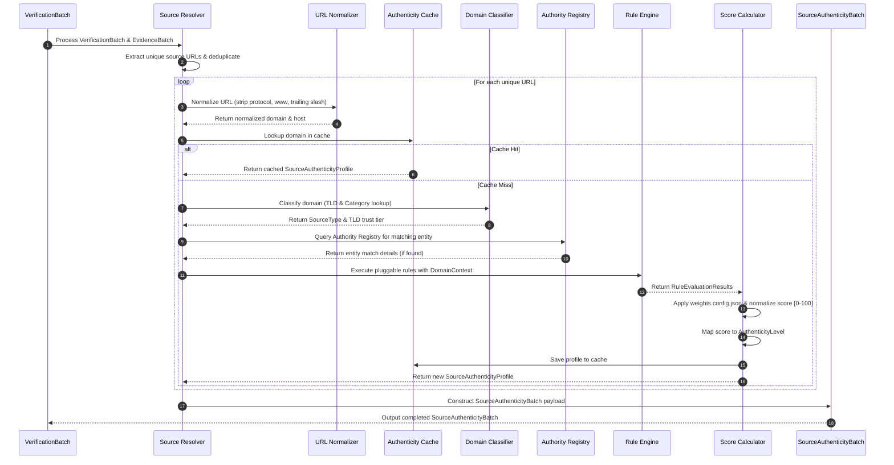

# TruthForge-AI Phase 4 – Source Authenticity Evaluation Engine Architecture

## 1. Executive Summary

This document details the production-grade architectural design, technical specification, data contracts, component responsibilities, evaluation methodology, and extensibility framework for **Phase 4 – Source Authenticity Evaluation Engine** of **TruthForge-AI**.

The **Source Authenticity Evaluation Engine** sits directly downstream of **Claim Verification (Phase 3)** and upstream of **Evidence Lineage Tracker (Phase 5)**. Its sole responsibility is to systematically analyze and evaluate the credibility, institutional recognition, and baseline authenticity score of every unique source URL referenced by verified claims.

The engine operates under a **strictly deterministic, explainable, configurable, and reproducible paradigm**. It explicitly avoids LLM reasoning, heuristic guesswork, or opaque scoring. Given identical inputs (`EvidenceBatch` and `VerificationBatch`), the engine produces 100% byte-identical, audit-verifiable outputs (`SourceAuthenticityBatch`).

---

## 2. Pipeline Position & Operational Scope

### 2.1 End-to-End System Context

```text
User Query
    │
    ▼
Query Analyzer
    │
    ▼
Deterministic Domain Scraper
    │
    ▼
Retrieval Model
    │
    ▼
Evidence Ingestion Module
    │
    ▼
Evidence Profiling Engine
    │
    ▼
Claim Generator (Phase 2)
    │
    ▼
Claim Verification (Phase 3)
    │
    ▼
Source Authenticity Evaluation Engine (Phase 4)  <--- [ DESIGNED IN THIS SPECIFICATION ]
    │
    ▼
Evidence Lineage Tracker (Phase 5)
    │
    ▼
Confidence Engine (Phase 6)
    │
    ▼
Report Generator (Phase 7)
```

### 2.2 Input/Output Interfacing

- **Inputs Consumed**:
  1. `EvidenceBatch`: Contains raw ingested evidence records, source metadata, original URLs, and ingested headers.
  2. `VerificationBatch`: Contains verified claims output from Phase 3, referencing specific `evidenceId`s and associated source URLs.
- **Outputs Produced**:
  - `SourceAuthenticityBatch`: Contains an array of evaluated `SourceAuthenticityProfile` objects for all unique source URLs referenced by verified claims.

---

## 3. Module Responsibilities & Operational Boundaries

### 3.1 Primary Responsibility

The Source Authenticity Evaluation Engine has **one and only one responsibility**:
> **Determine the authenticity and credibility of every unique source referenced by verified claims.**

The engine answers the single question: **"How trustworthy is this source?"**
It does **NOT** answer: *"Is this claim correct?"* (Claim correctness belongs strictly to Phase 3).

### 3.2 Strict Non-Responsibilities & Prohibitions

| Scope Category | Prohibited Operation | Correct Pipeline Owner |
| :--- | :--- | :--- |
| **Claim Verification** | Verify or re-evaluate claims | Phase 3 (Claim Verification) |
| **Claim Statement Modification** | Mutate, rewrite, split, or merge claim text | Phase 2 (Claim Generator) / Phase 3 |
| **Evidence Text Modification** | Rewrite, truncate, or re-parse evidence content | Phase 1 (Evidence Ingestion) |
| **Confidence Scoring** | Calculate overall claim/verdict confidence scores | Phase 6 (Confidence Engine) |
| **Claim Ranking** | Rank or prioritize verified claims | Phase 6 (Confidence Engine) |
| **Report Generation** | Synthesize human-readable summaries or markdown reports | Phase 7 (Report Generator) |
| **Finding Summarization** | Summarize overall truthfulness or entity sentiments | Phase 7 (Report Generator) |

---

## 4. Architectural Principles & Design Philosophy

1. **Deterministic Execution**:
   - Zero LLM prompts or non-deterministic reasoning steps.
   - Outputs are computed via pure functions, regex rules, domain trees, and configured mathematical weights.
2. **Explainability & Auditability**:
   - Every score is backed by an explicit breakdown of `AuthenticityFactors` and `rulesApplied`.
   - Any external auditor can trace an authenticity score back to exact matching rules and registry versions.
3. **Externalized Configuration**:
   - No hardcoded lists of domains, scores, weights, or level thresholds inside source code.
   - All weights, TLD mappings, registry entries, and score boundaries are defined in JSON/YAML config files.
4. **Reproducibility**:
   - Identical inputs generate identical output profiles across different runs, environments, or execution nodes.
5. **Fail-Safe Pipeline Continuity**:
   - Failure to parse a URL, read a cache entry, or resolve a domain never crashes the pipeline.
   - Unresolvable sources fall back gracefully to `UNKNOWN` authenticity level with score `0` and detailed metadata error tags.

---

## 5. Folder Structure

The module lives under `backend/src/modules/authenticity/`.

```text
backend/src/modules/authenticity/
├── contracts/
│   ├── sourceAuthenticityProfile.contract.js   # JSDoc / TypeScript type contract for Profile
│   ├── sourceAuthenticityBatch.contract.js     # JSDoc / TypeScript type contract for Batch
│   └── authenticityFactors.contract.js         # JSDoc / TypeScript type contract for Factors
├── models/
│   ├── sourceAuthenticityProfile.model.js      # Domain entity class with serialization
│   └── sourceAuthenticityBatch.model.js        # Aggregate container domain entity
├── services/
│   ├── sourceAuthenticity.service.js           # Main pipeline orchestrator service
│   └── authorityRegistry.service.js            # Service managing dynamic registry loading
├── resolvers/
│   └── sourceResolver.js                       # Extracts unique URLs from VerificationBatch
├── normalizers/
│   └── urlNormalizer.js                        # Protocol, www, lowercase, & path normalization
├── classifiers/
│   ├── domainClassifier.js                     # Main domain classification router
│   └── tldClassifier.js                        # TLD lookup engine (.gov, .edu, .ac.uk, etc.)
├── registry/
│   ├── registryLoader.js                       # Reads and merges authority JSON registries
│   ├── government.json                         # Configured government agencies (WHO, NIH, CDC...)
│   ├── medical.json                            # Medical orgs & journals (PubMed, Lancet...)
│   ├── academic.json                           # Educational & university domains (.edu, .ac.uk...)
│   ├── scientific.json                         # Scientific publishers (Nature, IEEE, ACM...)
│   ├── international.json                      # Int'l bodies (UN, UNICEF, World Bank, OECD...)
│   └── news.json                               # Established news organizations
├── scorers/
│   └── scoreCalculator.js                      # Evaluates rules & calculates normalized 0-100 score
├── rules/
│   ├── baseRule.js                             # Abstract base class for authenticity rules
│   ├── registryMatchRule.js                    # Matches domain against Authority Registry
│   ├── tldTrustRule.js                         # Evaluated TLD trust tier
│   ├── securityRule.js                         # Evaluates HTTPS usage & security protocol
│   ├── publisherTypeRule.js                    # Evaluates publisher classification weight
│   ├── peerReviewRule.js                       # Evaluates peer-review / academic status
│   └── ruleRegistry.js                         # Dynamic rule container & discovery manager
├── validators/
│   ├── urlValidator.js                         # Validates URL format and protocol support
│   └── registryValidator.js                    # Validates JSON registry schema integrity
├── cache/
│   ├── cacheProvider.js                        # Abstract cache interface
│   ├── inMemoryCache.js                        # Map-based local in-memory cache
│   └── redisCache.js                           # Redis adapter for distributed caching
├── config/
│   ├── authenticityConfig.js                   # Load & validate factor weights and thresholds
│   ├── weights.config.json                     # Weighting factors for score calculation
│   └── thresholds.config.json                  # Score range to AuthenticityLevel mappings
├── utils/
│   └── domainUtils.js                          # Helpers for domain extraction, TLD parsing
└── docs/
    └── README.md                               # Developer guide & operational documentation
```

---

## 6. Component Responsibilities

| Component Directory | Main Module / Class | Responsibility |
| :--- | :--- | :--- |
| **resolvers/** | `SourceResolver` | Traverses `VerificationBatch` and linked `EvidenceBatch`, extracting all referenced source URLs while deduplicating and resolving canonical targets. |
| **normalizers/** | `UrlNormalizer` | Strip protocols (`http://`, `https://`), `www.` prefixes, trailing slashes, query parameters (optional), and convert hostnames to lowercase. Extract root domain. |
| **classifiers/** | `DomainClassifier` | Categorize domains into canonical types (e.g. `Government`, `Academic Journal`, `Medical Organization`, `Commercial`, `Unknown`). |
| **registry/** | `AuthorityRegistry` | Manages loading, caching, versioning, and querying of trusted domain databases stored in modular JSON config files. |
| **rules/** | `RuleEngine` & Rules | Pluggable suite of evaluation rules that inspect source properties and produce partial factor scores based on configured criteria. |
| **scorers/** | `ScoreCalculator` | Aggregates rule execution outputs, applies configured weights from `weights.config.json`, normalizes the total to `0–100`, and maps to an `AuthenticityLevel`. |
| **cache/** | `AuthenticityCache` | Provides fast lookup and store mechanism for previously evaluated domain profiles to eliminate duplicate computation across queries/batches. |
| **validators/** | `Validators` | Ensures structural validity of input URLs, output contracts, and loaded JSON registry configurations. |

---

## 7. Data Contracts

### 7.1 `SourceAuthenticityProfile` Interface

```typescript
export interface AuthenticityFactors {
  institutionRecognition: number;  // 0 - 100
  topLevelDomainTrust: number;     // 0 - 100
  securityProtocol: number;        // 0 - 100 (HTTPS = 100, HTTP = 0)
  authorityRegistryMatch: number;  // 0 - 100
  publisherTypeWeight: number;     // 0 - 100
  peerReviewedStatus: number;      // 0 - 100
  isResearchRepository: boolean;
  isGovernmentOwned: boolean;
  isMedicalAuthority: boolean;
  isEducationalInstitution: boolean;
  isStandardsOrganization: boolean;
  isInternationalOrganization: boolean;
}

export interface EvaluationMetadata {
  evaluatedAt: string;        // ISO 8601 timestamp
  evaluatorVersion: string;   // e.g. "1.0.0"
  registryVersion: string;    // e.g. "2026.07.01"
  rulesApplied: string[];     // Array of rule IDs evaluated
  cacheHit: boolean;          // True if retrieved from cache
  executionTimeMs: number;    // Execution latency in milliseconds
}

export interface SourceAuthenticityProfile {
  sourceId: string;           // Deterministic hash of normalized domain/URL
  sourceUrl: string;          // Original raw URL
  normalizedUrl: string;      // Normalized URL string
  domain: string;             // Extracted registered domain (e.g., "who.int")
  sourceType: SourceType;     // Categorized source type
  authenticityScore: number;  // Normalized integer score [0 - 100]
  authenticityLevel: AuthenticityLevel;
  evaluationFactors: AuthenticityFactors;
  metadata: EvaluationMetadata;
}

export type AuthenticityLevel =
  | "VERY_HIGH"
  | "HIGH"
  | "MEDIUM"
  | "LOW"
  | "UNKNOWN";

export type SourceType =
  | "Government"
  | "Academic Journal"
  | "University"
  | "Medical Organization"
  | "International Organization"
  | "Research Repository"
  | "Scientific Publisher"
  | "Standards Organization"
  | "News Organization"
  | "Commercial"
  | "Community Wiki"
  | "Blog"
  | "Forum"
  | "Social Media"
  | "Unknown";
```

### 7.2 `SourceAuthenticityBatch` Interface

```typescript
export interface SourceAuthenticityBatch {
  batchId: string;
  query: string;
  totalSources: number;
  evaluatedSources: SourceAuthenticityProfile[];
  generatedAt: string;
  executionSummary: {
    totalExecutionTimeMs: number;
    cacheHitRatio: number;
    failedEvaluations: number;
  };
}
```

---

## 8. Step-by-Step Evaluation Workflow

```text
VerificationBatch + EvidenceBatch
               │
               ▼
   1. [ Source Resolver ] ──(Extract & Deduplicate URLs)
               │
               ▼
    2. [ URL Normalizer ] ──(Strip protocol/www, lowercase, trim)
               │
               ▼
 3. [ Authenticity Cache ] ──(Lookup canonical domain in Redis/Memory)
       │              │
  (Cache Hit)    (Cache Miss)
       │              │
       │              ▼
       │     4. [ Domain Classifier ] ──(Map TLD & Categories)
       │              │
       │              ▼
       │     5. [ Authority Registry ] ──(Lookup WHO, NIH, IEEE...)
       │              │
       │              ▼
       │     6. [ Rule Engine ] ──(Execute Pluggable Rule Array)
       │              │
       │              ▼
       │     7. [ Score Calculator ] ──(Apply Weights -> 0-100 Score & Level)
       │              │
       │              ▼
       │     8. [ Cache Store ] ──(Save Profile for future lookups)
       │              │
       └──────────────┴──────► 9. [ SourceAuthenticityBatch ]
```

---

## 9. Detailed Component Specifications

### 9.1 Source Resolver (`resolvers/sourceResolver.js`)

#### Operation & extraction logic
1. Scans every `VerifiedClaim` in the `VerificationBatch`.
2. Extracts referenced `evidenceId`s.
3. Maps `evidenceId`s back to raw evidence items in `EvidenceBatch` to locate source URLs.
4. Collects all extracted raw source URLs into an array.
5. Performs canonical deduplication: multiple claims referencing the same source URL are resolved to a single unique evaluation task.

#### Corner case handling
- **Duplicate URLs**: Grouped by normalized URL identifier.
- **Different paths on same domain**: Processed independently if deep path inspection rules exist, or aggregated to root domain level for baseline domain scoring.
- **HTTP Redirects**: If redirect lineage is supplied in evidence headers (`finalUrl`), both original and destination domain are resolved; final destination domain takes precedence.
- **Malformed URLs**: Invalid string schemas (e.g. `htps://invalid..com`) are caught by `UrlValidator`, flagged as malformed, and assigned default `UNKNOWN` profile without crashing.

---

### 9.2 URL Normalization (`normalizers/urlNormalizer.js`)

#### Normalization steps
1. **Lowercase Normalization**: Convert entire URL string to lowercase.
2. **Protocol Removal**: Strip scheme prefixes (`http://`, `https://`, `ftp://`).
3. **Subdomain / WWW Stripping**: Strip standard `www.` or `www[0-9].` subdomains while preserving functional subdomains (e.g., `news.bbc.co.uk` -> domain `bbc.co.uk`, host `news.bbc.co.uk`).
4. **Trailing Slash & Fragment Stripping**: Remove trailing slashes `/`, hash fragments `#header`, and tracking query parameters (`?utm_source=...`).
5. **Domain Extraction**: Utilize Public Suffix List parsing to extract root registered domain (`who.int`, `nasa.gov`, `ox.ac.uk`).

#### Transformation Examples

| Raw Input URL | Normalized URL | Extracted Registered Domain |
| :--- | :--- | :--- |
| `https://www.who.int/news/item/10-05-2026` | `who.int/news/item/10-05-2026` | `who.int` |
| `HTTPS://WWW.NASA.GOV/` | `nasa.gov` | `nasa.gov` |
| `http://sciencedirect.com:8080/article/123?utm=1#sec` | `sciencedirect.com/article/123` | `sciencedirect.com` |
| `https://subdomain.ox.ac.uk/research/` | `subdomain.ox.ac.uk/research` | `ox.ac.uk` |

---

### 9.3 Source Classification Strategy (`classifiers/domainClassifier.js`)

Categorizes every source into one of **15 canonical categories**:

1. `Government`: Direct governmental bodies and state agencies.
2. `Academic Journal`: Peer-reviewed academic publications and journals.
3. `University`: Accredited higher education institutions.
4. `Medical Organization`: Recognized healthcare and medical authorities.
5. `International Organization`: Intergovernmental bodies (UN, WHO, World Bank).
6. `Research Repository`: Pre-print and paper archives (arXiv, bioRxiv, PubMed).
7. `Scientific Publisher`: Commercial/non-profit scientific academic publishers (IEEE, Elsevier, Springer).
8. `Standards Organization`: Official standards specification bodies (ISO, NIST, IEEE-SA, W3C).
9. `News Organization`: Established editorial journalism outlets.
10. `Commercial`: Corporate, marketing, or general `.com` commercial sites.
11. `Community Wiki`: User-edited collaborative knowledge bases (Wikipedia, Fandom).
12. `Blog`: Personal or informal opinion logs.
13. `Forum`: Public message boards and discussion sites (Reddit, StackOverflow).
14. `Social Media`: User-generated social networks (X/Twitter, LinkedIn, Facebook).
15. `Unknown`: Fallback category for unrecognized domains.

---

### 9.4 Top-Level Domain (TLD) Classification Rules (`classifiers/tldClassifier.js`)

Deterministic TLD mapping hierarchy:

| TLD Pattern | Assigned Source Type | Default TLD Trust Tier |
| :--- | :--- | :--- |
| `.gov`, `.gov.*` | `Government` | `TIER_1` (Highest) |
| `.edu`, `.edu.*` | `University` | `TIER_1` (Highest) |
| `.ac.uk`, `.ac.*` | `Academic` | `TIER_1` (Highest) |
| `.int` | `International Organization` | `TIER_1` (Highest) |
| `.mil` | `Government` | `TIER_1` (Highest) |
| `.org` | `Organization` | `TIER_2` (Moderate) |
| `.com`, `.co` | `Commercial` | `TIER_3` (Standard) |
| `.net`, `.io` | `Commercial` | `TIER_3` (Standard) |
| Unknown TLDs | `Unknown` | `TIER_4` (Low / Baseline) |

---

### 9.5 Authority Registry Design (`registry/`)

The Authority Registry maintains curated collections of high-trust domain entities.
**Strict Constraint**: The registry is **never hardcoded in source code**. It is stored as modular JSON datasets under `backend/src/modules/authenticity/registry/`.

#### Directory Layout
```text
registry/
├── government.json     # WHO, NIH, CDC, NASA, NIST, FDA, EMA...
├── medical.json        # PubMed, Lancet, BMJ, NEJM...
├── academic.json       # MIT, Harvard, Oxford, Stanford...
├── scientific.json     # Nature, IEEE, ACM, ScienceDirect, Springer...
├── international.json  # UN, UNICEF, OECD, World Bank, IMF...
└── standards.json      # ISO, IEEE-SA, W3C, IETF, NIST...
```

#### Registry Entry JSON Schema (`registry/*.json`)

```json
{
  "version": "2026.07.01",
  "category": "Medical Organization",
  "entries": [
    {
      "id": "WHO_001",
      "name": "World Health Organization",
      "domain": "who.int",
      "sourceType": "International Organization",
      "recognitionScore": 100,
      "isMedicalAuthority": true,
      "isInternationalOrganization": true,
      "peerReviewed": false,
      "aliases": ["who.int", "www.who.int"]
    },
    {
      "id": "NIH_001",
      "name": "National Institutes of Health",
      "domain": "nih.gov",
      "sourceType": "Government",
      "recognitionScore": 100,
      "isMedicalAuthority": true,
      "isGovernmentOwned": true,
      "peerReviewed": true
    }
  ]
}
```

#### Registry Dynamic Update & Versioning Strategy
- **Hot-Reloading**: The `AuthorityRegistryService` uses file-system watchers or in-memory TTL reloading to pick up JSON registry updates without server restarts.
- **Schema Validation**: Every registry JSON file is validated against a strict JSON schema (`registryValidator.js`) during load. Corrupted files trigger a fallback to the previous valid in-memory registry version and log an alert event.

---

### 9.6 Authenticity Factors Breakdown

The engine evaluates **12 explicit, independent factor metrics**:

1. **Institution Recognition (`institutionRecognition`)**: Score [0-100] based on globally accredited institutional stature in the registry.
2. **Top-Level Domain Trust (`topLevelDomainTrust`)**: Score [0-100] derived deterministically from TLD tier (`.gov`=100, `.edu`=95, `.int`=95, `.org`=60, `.com`=40).
3. **Security Protocol (`securityProtocol`)**: Binary/weighted score based on transport encryption (HTTPS = 100, HTTP = 0).
4. **Authority Registry Match (`authorityRegistryMatch`)**: Direct lookup match score against configured high-trust registries (Exact match = 100, Alias match = 90, Partial sub-domain match = 75, No match = 0).
5. **Publisher Type Weight (`publisherTypeWeight`)**: Weight [0-100] assigned to the publisher class (`Scientific Publisher`=95, `News`=70, `Blog`=20, `Social Media`=10).
6. **Peer Reviewed Indicator (`peerReviewedStatus`)**: Boolean/weighted metric [0 or 100] indicating if source enforces peer-review process.
7. **Research Repository (`isResearchRepository`)**: Boolean flag (e.g. arXiv, bioRxiv, PubMed Central).
8. **Government Ownership (`isGovernmentOwned`)**: Boolean flag indicating state/governmental ownership.
9. **Medical Authority (`isMedicalAuthority`)**: Boolean flag for medical regulatory/research bodies (FDA, EMA, WHO, CDC).
10. **Educational Institution (`isEducationalInstitution`)**: Boolean flag for university/higher education domain.
11. **Standards Organization (`isStandardsOrganization`)**: Boolean flag for formal standard specification bodies.
12. **International Organization (`isInternationalOrganization`)**: Boolean flag for intergovernmental bodies.

---

### 9.7 Deterministic Scoring Engine & Formula

#### Externalized Configuration (`config/weights.config.json`)

```json
{
  "version": "1.0.0",
  "weights": {
    "authorityRegistryMatch": 0.35,
    "institutionRecognition": 0.25,
    "topLevelDomainTrust": 0.15,
    "publisherTypeWeight": 0.10,
    "peerReviewedStatus": 0.10,
    "securityProtocol": 0.05
  }
}
```

#### Deterministic Formula
$$\text{RawScore} = \sum_{f \in \text{Factors}} \left( \text{FactorScore}_f \times \text{Weight}_f \right)$$

$$\text{AuthenticityScore} = \text{Math.min}\left(100, \text{Math.max}\left(0, \text{Math.round}(\text{RawScore})\right)\right)$$

*Note*: No arbitrary AI weights. All weights sum exactly to `1.00` and are strictly loaded from `weights.config.json`.

---

### 9.8 Authenticity Levels & Threshold Mapping

Scores map deterministically to 5 human-interpretable level thresholds loaded from `config/thresholds.config.json`:

```json
{
  "thresholds": [
    { "level": "VERY_HIGH", "minScore": 90, "maxScore": 100 },
    { "level": "HIGH",      "minScore": 75, "maxScore": 89 },
    { "level": "MEDIUM",    "minScore": 55, "maxScore": 74 },
    { "level": "LOW",       "minScore": 30, "maxScore": 54 },
    { "level": "UNKNOWN",   "minScore": 0,  "maxScore": 29 }
  ]
}
```

---

### 9.9 Pluggable Rule Engine (`rules/`)

The Rule Engine operates via pluggable rule interfaces implementing `BaseRule`.

```typescript
export interface BaseRule {
  id: string;
  name: string;
  description: string;
  execute(domainContext: DomainContext): RuleEvaluationResult;
}

export interface RuleEvaluationResult {
  ruleId: string;
  factorImpacted: keyof AuthenticityFactors;
  scoreContribution: number;
  metadata: Record<string, any>;
}
```

#### Execution Loop
1. `RuleRegistry` collects all registered rule instances.
2. `RuleEngine` iterates over rules sequentially or in parallel.
3. Each rule evaluates the domain context and returns a `RuleEvaluationResult`.
4. `ScoreCalculator` aggregates results, applies `weights.config.json`, and computes the final `SourceAuthenticityProfile`.

---

## 10. Caching Strategy (`cache/`)

Evaluating the same domain repeatedly across thousands of incoming claims is wasteful. Phase 4 incorporates a two-tier caching design:

1. **In-Memory Cache (`inMemoryCache.js`)**: LRU map holding up to 10,000 active domain profiles in node process RAM for sub-millisecond evaluation latency.
2. **Distributed Cache (`redisCache.js`)**: Optional Redis client adapter using key prefix `truthforge:authenticity:v1:<domain_hash>` with configured TTL (e.g. 24 hours).

```text
Source Evaluation Request
          │
          ▼
   [ Memory Cache ] ──(Hit: < 1ms) ──► Return Profile
          │
       (Miss)
          ▼
    [ Redis Cache ] ──(Hit: < 5ms) ──► Populate RAM & Return Profile
          │
       (Miss)
          ▼
[ Rule Engine Evaluation ] ──► Store RAM + Redis ──► Return Profile
```

---

## 11. Validation, Logging & Error Handling

### 11.1 Validation Rules (`validators/`)
- **URL Schema**: Verifies presence of valid domain format using RFC 3986 regex patterns.
- **Protocol**: Flags non-HTTP/HTTPS schemes (`file://`, `ftp://`).
- **Registry Schema**: Validates loaded JSON files against JSON Schema before registration.

### 11.2 Structured JSON Logging Format

```json
{
  "timestamp": "2026-07-26T01:07:03.120Z",
  "stage": "Source Authenticity",
  "event": "SOURCE_EVALUATED",
  "domain": "who.int",
  "score": 98,
  "level": "VERY_HIGH",
  "classification": "Medical Organization",
  "cacheHit": true,
  "executionTimeMs": 1
}
```

#### Log Event Types
- `REGISTRY_LOADED`: Emitted when authority JSON files are initialized.
- `REGISTRY_UPDATED`: Emitted when dynamic hot-reload detects new files.
- `SOURCE_EVALUATED`: Emitted for each completed domain profile.
- `MALFORMED_URL_DETECTED`: Emitted when an invalid URL is sanitized.
- `CACHE_HIT` / `CACHE_MISS`: Emitted for cache performance monitoring.
- `EVALUATION_COMPLETED`: Emitted at batch completion with summary statistics.

### 11.3 Pipeline Fault Tolerance & Error Recovery

| Failure Scenario | Engine Behavior | Resilience Outcome |
| :--- | :--- | :--- |
| **Malformed Source URL** | Catches parsing error; returns default `UNKNOWN` profile (score `0`). | Pipeline continues without throwing. |
| **Corrupted Registry JSON** | Reverts to last valid in-memory registry snapshot; logs `REGISTRY_CORRUPTED` alert. | Engine stays operational. |
| **Redis Cache Down** | Fallback gracefully to `InMemoryCache` or bypass cache layer entirely. | Evaluation completes with slightly higher latency. |
| **Unknown TLD / Domain** | Applies fallback domain classification (`Commercial` or `Unknown`) and baseline trust tier score. | Deterministic fallback score calculated. |

---

## 12. Sequence Diagram



---

## 13. Future Extensibility Architecture

1. **Country-Specific Trust Registries**: Ability to plug in `registry/countries/uk.json`, `registry/countries/in.json` for region-specific domain trust scoring.
2. **Organization-Specific Custom Rules**: Support enterprise policy overrides via `rules/custom/enterpriseRules.json`.
3. **Offline Registry Updates**: Automated CI/CD script syncing registry JSON files against external authoritative lists (e.g. IANA, PubMed database dumps).
4. **Plugin-Based Rule Loading**: Dynamically import third-party npm package rules implementing the `BaseRule` interface.
5. **Optional ML-Assisted Source Scoring**: Future optional module extension to complement deterministic scores with ML domain reputation models without changing the core downstream `SourceAuthenticityBatch` contract.

---

## 14. Testing Strategy

### 14.1 Unit Testing Strategy
- **URL Normalization Tests**: Test normalization against 50+ corner-case URLs (subdomains, trailing slashes, port numbers, unusual parameters).
- **Classification Tests**: Verify TLD and category classification across `.gov`, `.edu`, `.ac.uk`, `.int`, `.org`, `.com`.
- **Registry Matching Tests**: Test exact, alias, and subdomain matching against `government.json`, `medical.json`, etc.
- **Scoring & Weighting Tests**: Verify mathematical accuracy of `ScoreCalculator` given controlled factor inputs.
- **Cache Tests**: Test cache hits, TTL expiration, and fallback from Redis to memory.

### 14.2 Integration Testing Strategy
- **End-to-End Evaluation Flow**: Feed mock `VerificationBatch` and `EvidenceBatch` inputs and assert valid structural `SourceAuthenticityBatch` outputs.
- **Duplicate Source Recovery**: Pass 100 claims referencing the same 3 domains; verify exactly 3 domain evaluations occur.
- **Fault Tolerant Batch Execution**: Include malformed URLs and corrupted context; verify pipeline completes with 100% success rate.

### 14.3 Manual Verification Protocol
1. Load a curated domain test set containing 20 high-trust domains (`who.int`, `nasa.gov`, `nature.com`, `nih.gov`) and 20 low-trust/unknown domains.
2. Execute evaluation engine against test batch.
3. Validate that high-trust domains receive `VERY_HIGH` or `HIGH` ratings, while unknown domains fall cleanly into `LOW` or `UNKNOWN` tiers.
