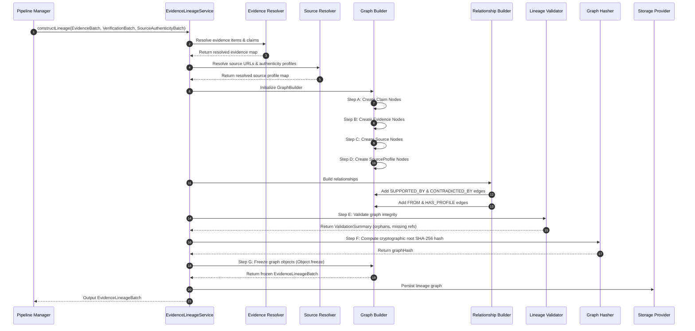

# TruthForge-AI Phase 5 – Evidence Lineage Engine Architecture & Specification

## 1. Executive Summary

This document details the production-grade architectural design, technical specification, data contracts, component responsibilities, graph abstractions, validation rules, error recovery, logging strategy, sequence flows, and extensibility framework for **Phase 5 – Evidence Lineage Engine** of **TruthForge-AI**.

The **Evidence Lineage Engine** sits directly downstream of **Source Authenticity Evaluation (Phase 4)** and upstream of **Confidence Engine (Phase 6)**. Its sole and immutable responsibility is to construct an audit-verifiable, deterministic, and immutable provenance graph that connects every verified claim to its exact supporting/contradicting evidence snippets, original source URLs, and institutional source authenticity profiles.

The engine operates under a **strictly deterministic, graph-database-agnostic, and immutable paradigm**. Given identical inputs (`EvidenceBatch`, `VerificationBatch`, and `SourceAuthenticityBatch`), the engine produces 100% byte-identical, cryptographic hash-verified lineage outputs (`EvidenceLineageBatch`).

---

## 2. Pipeline Position & Operational Scope

### 2.1 End-to-End System Context

```text
User Query
    │
    ▼
Query Analyzer
    │
    ▼
Deterministic Domain Scraper
    │
    ▼
Retrieval Model
    │
    ▼
Evidence Ingestion Module
    │
    ▼
Evidence Profiling Engine
    │
    ▼
Claim Generator (Phase 2)
    │
    ▼
Claim Verification (Phase 3)
    │
    ▼
Source Authenticity Evaluation (Phase 4)
    │
    ▼
Evidence Lineage Engine (Phase 5)  <--- [ DESIGNED IN THIS SPECIFICATION ]
    │
    ▼
Confidence Engine (Phase 6)
    │
    ▼
Report Generator (Phase 7)
```

### 2.2 Input/Output Interfacing

- **Inputs Consumed**:
  1. `EvidenceBatch`: Raw ingested evidence records, text snippets, original source URLs, and metadata.
  2. `VerificationBatch`: Verified claim entities output from Phase 3 containing lists of supporting (`supportingEvidenceIds`) and contradicting (`contradictingEvidenceIds`) evidence IDs.
  3. `SourceAuthenticityBatch`: Source authenticity profiles output from Phase 4 containing domain ratings, trust levels, and factors.
- **Outputs Produced**:
  - `EvidenceLineageBatch`: An immutable, fully connected provenance graph structure detailing exact claim-to-evidence-to-source-to-profile lineage.

---

## 3. Module Responsibilities & Operational Boundaries

### 3.1 Primary Responsibility

The Evidence Lineage Engine has **one and only one responsibility**:

> **Build a complete, immutable provenance graph showing how every verified claim is connected to its supporting evidence and original sources.**

The engine answers the single fundamental question: **"Exactly where did this verified claim come from?"** Every verified claim must be traceable back to its underlying evidence and original source without inferring or guessing any connections.

### 3.2 Strict Non-Responsibilities & Prohibitions

| Scope Category | Prohibited Operation | Correct Pipeline Owner |
| :--- | :--- | :--- |
| **Claim Verification** | Verify, test, or re-evaluate claim truthfulness | Phase 3 (Claim Verification) |
| **Claim Modification** | Mutate, rewrite, split, or merge claim statements | Phase 2 / Phase 3 |
| **Evidence Text Modification** | Rewrite, truncate, or alter evidence text snippets | Phase 1 (Evidence Ingestion) |
| **Confidence Calculation** | Compute claim, verdict, or overall confidence scores | Phase 6 (Confidence Engine) |
| **Credibility Evaluation** | Evaluate source trust, TLD tiers, or domain authority | Phase 4 (Source Authenticity) |
| **Claim Ranking** | Order or prioritize verified claims | Phase 6 (Confidence Engine) |
| **Report Generation** | Generate human-readable markdown reports or UI summaries | Phase 7 (Report Generator) |

---

## 4. Architectural Principles & Design Philosophy

1. **Deterministic Execution**:
   - Zero non-deterministic logic, LLM reasoning, or heuristic guesswork.
   - Lineage graph construction is a pure function of input batches.
2. **Immutable Provenance Graph**:
   - Once a lineage graph is constructed and validated, its nodes, edges, and batch objects are frozen (`Object.freeze`).
   - Graph integrity is locked using a SHA-256 cryptographic root hash.
3. **Database-Agnostic Core Logic**:
   - The core business logic operates purely on in-memory domain entities (`GraphNode`, `GraphEdge`, `ClaimLineage`).
   - Graph storage (Neo4j, JanusGraph, Neptune, GraphQL APIs) is decoupled via abstract storage adapters.
4. **Complete Traceability (Zero Broken Links)**:
   - Every claim must trace through explicit edges: `Claim` ──► `Evidence` ──► `Source` ──► `SourceProfile`.
   - Inferred, implicit, or floating unlinked claims are prohibited.
5. **Fail-Safe Pipeline Continuity**:
   - Missing source profiles or orphan evidence references are flagged as validation warnings in lineage metadata, but linked with fallback placeholder nodes so pipeline execution never halts or crashes.

---

## 5. Folder Structure & Directory Explanation

The module lives under `backend/src/modules/lineage/`.

```text
backend/src/modules/lineage/
├── contracts/                  # TypeScript / JSDoc data interface definitions
│   ├── evidenceReference.contract.js   # Contract for EvidenceReference interface
│   ├── claimLineage.contract.js        # Contract for ClaimLineage interface
│   ├── evidenceLineageBatch.contract.js# Contract for EvidenceLineageBatch interface
│   └── graphStorage.contract.js        # Contract for StorageProvider adapter interface
├── models/                     # In-memory domain entities and aggregate roots
│   ├── claimLineage.model.js           # Domain entity for individual claim lineage
│   ├── evidenceLineageBatch.model.js   # Domain aggregate root container
│   ├── graphNode.model.js              # Domain node entity (Claim, Evidence, Source, Profile)
│   └── graphEdge.model.js              # Domain edge entity (SUPPORTED_BY, FROM, HAS_PROFILE)
├── services/                    # High-level pipeline orchestration service
│   └── evidenceLineage.service.js      # Core entrypoint coordinating workflow steps
├── resolvers/                  # Input batch resolution and entity mapping
│   ├── evidenceResolver.js             # Resolves evidence items from VerificationBatch & EvidenceBatch
│   └── sourceResolver.js               # Resolves source URLs & authentication profiles
├── builders/                   # Deterministic graph node and edge builders
│   ├── relationshipBuilder.js          # Constructs directed edges (SUPPORTED_BY, CONTRADICTED_BY, FROM, HAS_PROFILE)
│   └── graphBuilder.js                 # Orchestrates node/edge assembly in order and handles graph freezing
├── validators/                 # Graph integrity, structural, and cycle validation
│   └── lineageValidator.js             # Validates graph integrity (orphans, cycles, missing IDs, duplicates)
├── graph/                      # Core graph structures and hashing algorithms
│   ├── memoryGraph.js                  # In-memory adjacency list & node index representation
│   └── graphHasher.js                  # SHA-256 cryptographic graph integrity hasher
├── storage/                    # Database-agnostic persistence adapters
│   ├── storageProvider.js              # Abstract graph storage interface
│   ├── inMemoryStorage.js              # Local in-memory graph repository adapter
│   └── neo4jStorage.js                 # Neo4j graph database adapter (extensible stub)
├── cache/                      # Decoupled graph caching abstractions
│   ├── cacheProvider.js                # Abstract cache interface
│   └── lineageCache.js                 # In-memory & distributed lineage graph cache manager
├── queries/                    # High-level graph traversal query interfaces
│   ├── lineageQueryInterface.js        # Abstract query signature contract
│   └── lineageQueryEngine.js           # In-memory graph traversal query execution engine
├── config/                     # Module configuration settings
│   └── lineageConfig.js                # Immutability, hashing, and resolution thresholds
├── utils/                      # Helper utilities
│   └── lineageUtils.js                 # Hash generation & graph helper utilities
└── docs/                       # Architectural documentation and operational specs
    └── README.md                       # Module developer & operational overview
```

### Detailed Directory Responsibilities

- **`contracts/`**: Enforces strict contract boundaries for data passed into and out of the module.
- **`models/`**: Defines rich domain models representing graph components, maintaining immutability helpers.
- **`services/`**: Exposes `EvidenceLineageService`, the main orchestrator called by the central pipeline driver.
- **`resolvers/`**: Extracts entity relationships from raw input batches and indexes them for fast $O(1)$ lookup.
- **`builders/`**: Houses step-by-step deterministic node/edge instantiation logic adhering to strict ordering.
- **`validators/`**: Runs graph validation algorithms (e.g. cycle detection, orphan detection, broken link checks).
- **`graph/`**: Holds in-memory graph data structures and cryptographic hashing utilities.
- **`storage/`**: Provides abstract storage interfaces and adapters for persisting graphs without locking logic to specific DBs.
- **`cache/`**: Abstracts node, edge, and graph caching layer to support speed-ups without hard coupling to Redis.
- **`queries/`**: Exposes expressive query methods for inspecting and traversing constructed lineage graphs.
- **`config/`**: Contains environment settings and versioning configurations for the engine.
- **`utils/`**: Shared pure helper functions for deterministic serialization, ID generation, and string normalization.
- **`docs/`**: Operational guides and developer documentation.

---

## 6. Component Responsibilities Matrix

| Component / Sub-module | Class / Module | Primary Responsibility |
| :--- | :--- | :--- |
| **Service Layer** | `EvidenceLineageService` | Orchestrates the end-to-end lineage generation process, invoking resolvers, builders, validators, and hashing. |
| **Evidence Resolver** | `EvidenceResolver` | Maps claim supporting/contradicting evidence IDs to actual `EvidenceBatch` snippets and extracts source URLs. |
| **Source Resolver** | `SourceResolver` | Links evidence source URLs to corresponding `SourceAuthenticityProfile` records in `SourceAuthenticityBatch`. |
| **Relationship Builder** | `RelationshipBuilder` | Instantiates deterministic directed edges (`SUPPORTED_BY`, `CONTRADICTED_BY`, `FROM`, `HAS_PROFILE`). |
| **Graph Builder** | `GraphBuilder` | Manages node creation in strict order, attaches relationships, freezes graph objects, and computes root hash. |
| **Lineage Validator** | `LineageValidator` | Inspects graph topology for missing nodes, orphan evidence, duplicate edges, and circular dependencies. |
| **Memory Graph** | `MemoryGraph` | High-performance in-memory graph structure supporting fast adjacency lookups and depth-first traversals. |
| **Graph Hasher** | `GraphHasher` | Computes deterministic SHA-256 hash across sorted canonical representations of all graph nodes and edges. |
| **Storage Layer** | `StorageProvider` | Defines generic interface (`saveGraph`, `getGraph`, `query`) implemented by `InMemoryStorage`, `Neo4jStorage`, etc. |
| **Query Engine** | `LineageQueryEngine` | Implements `LineageQueryInterface` to support domain provenance queries over in-memory or persisted graphs. |
| **Cache Layer** | `LineageCache` | Provides generic caching interface for graph nodes, claim subgraphs, and full lineage batches. |

---

## 7. Data Contracts Specification

### 7.1 `EvidenceReference` Interface

```typescript
export type RelationshipType = "SUPPORTS" | "CONTRADICTS";

export interface EvidenceReference {
  /** Unique identifier of the evidence snippet */
  evidenceId: string;
  
  /** Unique identifier of the originating source */
  sourceId: string;
  
  /** Canonical URL of the evidence source */
  sourceUrl: string;
  
  /** Relationship type of evidence to claim */
  relationship: RelationshipType;
  
  /** Numerical relevance score [0.0 - 1.0] from ingestion/verification */
  relevance: number;
}
```

### 7.2 `ClaimLineage` Interface

```typescript
export interface ClaimLineage {
  /** Unique identifier of the verified claim */
  claimId: string;
  
  /** Array of supporting evidence references */
  supportingEvidence: EvidenceReference[];
  
  /** Array of contradicting evidence references */
  contradictingEvidence: EvidenceReference[];
  
  /** Array of referenced SourceAuthenticityProfile IDs linked to this claim */
  sourceProfiles: string[];
}
```

### 7.3 `EvidenceLineageBatch` Interface

```typescript
export interface LineageValidationSummary {
  totalNodes: number;
  totalEdges: number;
  orphanNodes: number;
  missingReferences: number;
  duplicateEdgesRemoved: number;
  isValid: boolean;
}

export interface LineageMetadata {
  /** ISO 8601 creation timestamp */
  generatedAt: string;
  
  /** Engine generator version (e.g. "1.0.0") */
  generatorVersion: string;
  
  /** Graph schema version (e.g. "v1") */
  graphVersion: string;
  
  /** SHA-256 root cryptographic hash of the lineage graph */
  graphHash: string;
  
  /** Total processing latency in milliseconds */
  executionTimeMs: number;
  
  /** Detailed validation breakdown */
  validationSummary: LineageValidationSummary;
}

export interface EvidenceLineageBatch {
  /** Unique identifier for this lineage batch */
  batchId: string;
  
  /** User query context */
  query: string;
  
  /** Total count of claims represented in lineage */
  totalClaims: number;
  
  /** Lineage breakdown per verified claim */
  lineage: ClaimLineage[];
  
  /** Execution and graph metadata */
  metadata: LineageMetadata;
}
```

---

## 8. Graph Model & Node/Edge Taxonomy

The Evidence Lineage Engine models provenance as a **Directed Acyclic Graph (DAG)**.

### 8.1 Graph Node Taxonomy

```typescript
export type NodeType = "Claim" | "Evidence" | "Source" | "SourceProfile";

export interface GraphNode {
  id: string;              // Deterministic node ID (e.g. "node:claim:clm_101")
  type: NodeType;          // Entity type
  label: string;           // Human-readable node label
  properties: Record<string, any>; // Entity metadata payload
}
```

1. **`Claim` Node**: Represents a verified claim entity output from Phase 3.
2. **`Evidence` Node**: Represents a textual evidence snippet ingested during Phase 1.
3. **`Source` Node**: Represents the canonical web URL / domain from which evidence was scraped.
4. **`SourceProfile` Node**: Represents the institutional credibility profile generated during Phase 4.

### 8.2 Graph Edge Taxonomy

```typescript
export type EdgeType =
  | "SUPPORTED_BY"    // Claim ──► Evidence
  | "CONTRADICTED_BY" // Claim ──► Evidence
  | "FROM"           // Evidence ──► Source
  | "HAS_PROFILE";    // Source ──► SourceProfile

export interface GraphEdge {
  id: string;              // Deterministic edge ID (e.g. "edge:clm_101:SUPPORTED_BY:ev_001")
  sourceNodeId: string;    // Tail node ID
  targetNodeId: string;    // Head node ID
  type: EdgeType;          // Edge relationship type
  properties: Record<string, any>;
}
```

---

## 9. Relationship Design & Traceability Rules

### 9.1 Edge Rationale Matrix

```text
    ┌─────────────────────────────────────────────────────────┐
    │                      [ Claim Node ]                     │
    └───────────────────────────┬─────────────────────────────┘
                                │
             ┌──────────────────┴──────────────────┐
             │ (SUPPORTED_BY)                      │ (CONTRADICTED_BY)
             ▼                                     ▼
  ┌──────────────────────┐              ┌──────────────────────┐
  │  [ Evidence Node A ] │              │  [ Evidence Node B ] │
  └──────────┬───────────┘              └──────────┬───────────┘
             │                                     │
             └──────────────────┬──────────────────┘
                                │ (FROM)
                                ▼
                      ┌───────────────────┐
                      │   [ Source Node ] │
                      └─────────┬─────────┘
                                │
                                │ (HAS_PROFILE)
                                ▼
                   ┌──────────────────────────┐
                   │  [ SourceProfile Node ]  │
                   └──────────────────────────┘
```

| Edge Type | Source Node | Target Node | Operational Rationale |
| :--- | :--- | :--- | :--- |
| **`SUPPORTED_BY`** | `Claim` | `Evidence` | Explicitly links a verified claim to an evidence snippet that substantiates its assertion. |
| **`CONTRADICTED_BY`** | `Claim` | `Evidence` | Explicitly links a verified claim to an evidence snippet that refutes or conflicts with its assertion. |
| **`FROM`** | `Evidence` | `Source` | Identifies the physical/web source URL location from which the evidence text was harvested. |
| **`HAS_PROFILE`** | `Source` | `SourceProfile` | Connects a web source location to its evaluated Phase 4 institutional authenticity profile. |

*No inferred or heuristic relationships (e.g., direct `Claim` ──► `SourceProfile`) are permitted.*

### 9.2 Lineage Traceability Rule

> **Every verified claim node in the lineage graph MUST have an unbroken, multi-hop directed traversal path to at least one `SourceProfile` node.**

$$\text{Claim} \xrightarrow{\text{SUPPORTED\_BY } \mid \text{ CONTRADICTED\_BY}} \text{Evidence} \xrightarrow{\text{FROM}} \text{Source} \xrightarrow{\text{HAS\_PROFILE}} \text{SourceProfile}$$

---

## 10. Graph Validation Strategy

The `LineageValidator` executes structural and integrity rules across the assembled graph prior to freezing.

| Anomaly Category | Detection Algorithm | Engine Handling & Mitigation |
| :--- | :--- | :--- |
| **Missing Evidence ID** | Claim references an `evidenceId` absent from `EvidenceBatch`. | Log warning; construct synthetic fallback `Evidence` node with `status: "MISSING_EVIDENCE_PAYLOAD"`. |
| **Missing Source ID / Profile** | Source URL has no matching profile in `SourceAuthenticityBatch`. | Log warning; construct fallback `SourceProfile` node with `authorityLevel: "UNKNOWN"`. |
| **Duplicate Relationships** | Multiple identical directed edges exist between same source and target nodes. | Automatically deduplicate during edge creation step; increment `duplicateEdgesRemoved` count. |
| **Orphan Evidence / Sources** | `Evidence` or `Source` node has zero incoming or outgoing connections. | Retain node in graph for audit, flag node in `validationSummary.orphanNodes`. |
| **Circular References** | Directed cycle detected (e.g. $A \to B \to A$) using Tarjan's / Kahn's algorithm. | Flag cycle violation in validation summary; break cycle deterministically. |
| **Invalid References** | Null, empty, or malformed ID strings present in relationship arrays. | Reject malformed string, log warning, skip invalid edge insertion. |

---

## 11. Graph Construction Workflow & Order of Operations

To guarantee 100% determinism, node and edge creation follows a strict sequence:

```text
VerificationBatch + EvidenceBatch + SourceAuthenticityBatch
                           │
                           ▼
               1. [ Evidence Resolver ] ──(Map evidence items)
                           │
                           ▼
                2. [ Source Resolver ] ──(Map URLs & profiles)
                           │
                           ▼
               3. [ Graph Builder Init ]
                           │
                           ▼
          Step A: Create All [ Claim Nodes ]
                           │
                           ▼
          Step B: Create All [ Evidence Nodes ]
                           │
                           ▼
          Step C: Create All [ Source Nodes ]
                           │
                           ▼
          Step D: Create All [ SourceProfile Nodes ]
                           │
                           ▼
    4. [ Relationship Builder ] ──► Step E: Connect All Directed Edges
                           │
                           ▼
 5. [ Lineage Validator ] ──► Step F: Run Integrity Check & Hash Generation
                           │
                           ▼
 6. [ Graph Immutability ] ──► Step G: Freeze Graph Objects (Object.freeze)
                           │
                           ▼
           7. Output [ EvidenceLineageBatch ]
```

### Deterministic Steps:
1. **Create Claim Nodes**: Instantiate a `Claim` graph node for every claim in `VerificationBatch`.
2. **Create Evidence Nodes**: Instantiate an `Evidence` graph node for every evidence snippet in `EvidenceBatch`.
3. **Create Source Nodes**: Instantiate a `Source` graph node for every unique canonical URL.
4. **Create Profile Nodes**: Instantiate a `SourceProfile` graph node for every profile in `SourceAuthenticityBatch`.
5. **Create Relationships**: Add directed edges (`SUPPORTED_BY`, `CONTRADICTED_BY`, `FROM`, `HAS_PROFILE`).
6. **Validate Graph**: Execute `LineageValidator` integrity rules.
7. **Freeze Graph**: Recursively freeze all node, edge, and lineage objects using `Object.freeze()`. Compute SHA-256 graph hash.

---

## 12. Storage Abstraction & Database Independence

The core lineage engine operates entirely independent of specific graph database drivers. Persistence operations are abstracted behind `StorageProvider`.

```typescript
export interface StorageProvider {
  /** Persist a completed EvidenceLineageBatch and its underlying graph */
  saveGraph(batch: EvidenceLineageBatch, graph: MemoryGraph): Promise<void>;
  
  /** Retrieve a persisted graph by batch ID */
  getGraph(batchId: string): Promise<MemoryGraph | null>;
  
  /** Execute an abstract query against the storage engine */
  query(query: LineageQuery): Promise<any>;
}
```

### Supported Storage Adapters (`storage/`):
- **`InMemoryStorage` (Default)**: High-performance in-memory repository used for inline pipeline execution.
- **`Neo4jStorage` (Adapter)**: Translates lineage graphs into Cypher queries (`CREATE (c:Claim)-[:SUPPORTED_BY]->(e:Evidence)`).
- **`JanusGraphStorage` / `NeptuneStorage` (Adapter)**: Gremlin / SPARQL adapter for AWS Neptune or JanusGraph enterprise clusters.
- **GraphQL Layer**: Decoupled GraphQL resolver layer built on top of `StorageProvider`.

---

## 13. Lineage Query Interfaces Design (`queries/`)

The module defines clear, strongly-typed query signatures to answer domain provenance questions without forcing storage dependencies onto downstream callers:

```typescript
export interface LineageQueryInterface {
  /** 1. Find all evidence supporting claim X */
  findSupportingEvidence(claimId: string): Promise<EvidenceReference[]>;

  /** 2. Find all claims using source Y */
  findClaimsBySource(sourceIdOrUrl: string): Promise<ClaimLineage[]>;

  /** 3. Find all claims contradicted by source Z */
  findClaimsContradictedBySource(sourceIdOrUrl: string): Promise<ClaimLineage[]>;

  /** 4. Find complete provenance path of claim X (Claim -> Evidence -> Source -> Profile) */
  findCompleteProvenance(claimId: string): Promise<{
    claim: GraphNode;
    evidence: GraphNode[];
    sources: GraphNode[];
    profiles: GraphNode[];
    edges: GraphEdge[];
  }>;

  /** 5. Find all claims using WHO sources */
  findClaimsByAuthority(authorityName: string): Promise<ClaimLineage[]>;

  /** 6. Find all evidence from Nature */
  findEvidenceByDomain(domain: string): Promise<GraphNode[]>;

  /** 7. Find all claims with multiple supporting sources */
  findClaimsWithMultipleSources(minSources: number): Promise<ClaimLineage[]>;
}
```

---

## 14. Caching Strategy Abstraction (`cache/`)

Caching is decoupled from Redis or specific key-value providers using `CacheProvider`:

```typescript
export interface CacheProvider {
  get<T>(key: string): Promise<T | null>;
  set<T>(key: string, value: T, ttlSeconds?: number): Promise<void>;
  del(key: string): Promise<void>;
}
```

### Granular Cache Layers (`LineageCache`):
1. **Graph Cache**: Full `EvidenceLineageBatch` graphs cached under `truthforge:lineage:batch:<batchId>`.
2. **Node Cache**: Individual graph nodes cached under `truthforge:lineage:node:<nodeId>`.
3. **Relationship Cache**: Directed relationship subgraphs cached under `truthforge:lineage:rel:<claimId>`.

---

## 15. Logging & Error Handling Strategy

### 15.1 Structured Log Specifications

All events emitted by the module produce structured JSON log entries:

```json
{
  "timestamp": "2026-07-26T01:15:58.100Z",
  "stage": "Evidence Lineage",
  "event": "LINEAGE_CREATED",
  "batchId": "elb_99f8e7a1",
  "claimId": "clm_101",
  "relationships": 8,
  "executionTimeMs": 5,
  "validationSummary": {
    "totalNodes": 48,
    "totalEdges": 64,
    "orphanNodes": 0,
    "missingReferences": 0,
    "duplicateEdgesRemoved": 1,
    "isValid": true
  }
}
```

#### Mandatory Emitted Events:
- `LINEAGE_INITIATED`: Logged when batch lineage processing starts.
- `GRAPH_CREATED`: Logged when nodes and edges are populated in memory.
- `VALIDATION_COMPLETED`: Logged after structural rules run.
- `ORPHAN_DETECTED`: Logged if disconnected evidence or source nodes are found.
- `DUPLICATE_REMOVED`: Logged when redundant edges are collapsed.
- `GRAPH_FROZEN`: Logged when immutability is applied and SHA-256 hash is assigned.
- `LINEAGE_CREATED`: Final summary log event.

### 15.2 Pipeline Resilience & Fault Recovery

| Failure Scenario | Mitigation Strategy | Pipeline Status |
| :--- | :--- | :--- |
| **Missing Evidence Item** | Insert synthetic placeholder node marked `status: "MISSING_EVIDENCE_PAYLOAD"`. | Pipeline continues cleanly. |
| **Missing Source Profile** | Insert fallback profile node marked `authorityLevel: "UNKNOWN"`. | Pipeline continues cleanly. |
| **Invalid Reference String** | Ignore invalid reference string; log `INVALID_REFERENCE_SKIPPED`. | Pipeline continues cleanly. |
| **Duplicate Edge Request** | Deduplicate edge; log `DUPLICATE_EDGE_REMOVED`. | Pipeline continues cleanly. |
| **Validation Failure** | Record validation errors in `metadata.validationSummary`; mark `isValid: false`. | Pipeline continues cleanly. |

*Crucial Rule: The lineage engine MUST NEVER crash the backend pipeline due to individual claim or evidence anomalies.*

---

## 16. Sequence Diagram



---

## 17. Future Extensibility Architecture

1. **Neo4j Integration**: Async background workers syncing frozen in-memory lineage graphs to Neo4j graph databases for complex multi-hop graph queries.
2. **GraphQL APIs**: GraphQL endpoint allowing frontend applications to query provenance trees cleanly (`claimLineage(id) { supportingEvidence { source { profile } } }`).
3. **Graph Visualization**: Dynamic visual graph inspector rendering force-directed DAG diagrams (using D3.js or Cytoscape.js).
4. **Provenance Export (JSON-LD / RDF)**: Exporting lineage graphs into W3C PROV-O standard JSON-LD / RDF formats for legal and academic auditability.
5. **Graph Analytics**: Running graph centrality and PageRank metrics to discover key influential sources across query domain topics.
6. **Graph Versioning & Distributed Storage**: Storing immutable lineage snapshots in IPFS or S3 with versioned graph diffing.

---

## 18. Testing Strategy

### 18.1 Unit Testing Strategy
- **Node & Edge Construction**: Test node instantiation, type assignment, and edge property binding.
- **Relationship Creation**: Test correct creation of `SUPPORTED_BY`, `CONTRADICTED_BY`, `FROM`, and `HAS_PROFILE` edges.
- **Lineage Validation**: Test detection of missing evidence IDs, missing source IDs, duplicate edges, and circular dependencies.
- **Hash Generation & Determinism**: Verify that identical input batches produce identical SHA-256 graph hashes across 100 consecutive runs.
- **Immutability Enforcement**: Verify that attempts to mutate frozen `EvidenceLineageBatch` objects throw runtime `TypeError`s.

### 18.2 Integration Testing Strategy
- **End-to-End Lineage Flow**: Pass realistic `VerificationBatch`, `EvidenceBatch`, and `SourceAuthenticityBatch` fixtures; assert valid `EvidenceLineageBatch` graph structure.
- **Missing Evidence Recovery**: Pass batches containing missing evidence IDs and missing source profiles; verify graceful fallback node creation without pipeline failure.
- **Orphan Detection**: Pass disconnected evidence items and verify correct reporting in `metadata.validationSummary`.

### 18.3 Manual Verification Protocol
1. Take a sample query batch ("Is vaccination effective against measles?").
2. Trace each claim in `EvidenceLineageBatch`:
   - Verify `claimId` ──► `evidenceId` ──► `sourceUrl` ──► `sourceProfileId`.
3. Confirm that zero broken links or unresolvable references exist across the entire batch lineage output.
