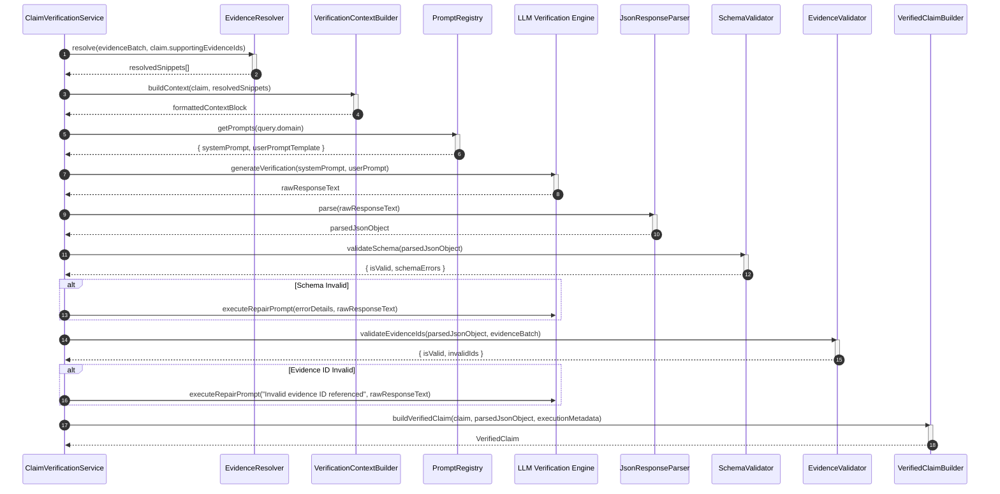

# TruthForge-AI Phase 3 – Claim Verification Architecture & Specification

## 1. Executive Summary

This document details the production-grade architectural design, data contracts, prompt engineering strategy, validation layers, error recovery mechanisms, and component responsibilities for **Phase 3 – Claim Verification** of **TruthForge-AI**.

The **Claim Verification** module sits directly downstream of the **Claim Generator** (Phase 2). Its single and immutable responsibility is to systematically evaluate whether each atomic claim in a `ClaimBatch` is supported, contradicted, partially supported, insufficient, or unverifiable based **strictly and exclusively** on the evidence provided in the `EvidenceBatch` and `EvidenceProfile`.

The module enforces strict **evidence-bounded verification**: it evaluates evidence fidelity without introducing external world knowledge, mutating claim statements, creating new claims, calculating confidence scores, or judging source credibility.

---

## 2. Pipeline Position & Operational Scope

### 2.1 End-to-End System Context

```text
User Query
    │
    ▼
Query Analyzer
    │
    ▼
Deterministic Domain Scraper
    │
    ▼
Retrieval Model
    │
    ▼
Evidence Ingestion Module
    │
    ▼
Evidence Profiling Engine
    │
    ▼
Claim Generator (Phase 2)
    │
    ▼
Claim Verification (Phase 3)  <--- [ DESIGNED IN THIS SPECIFICATION ]
    │
    ▼
Source Authenticity Evaluator (Phase 4)
    │
    ▼
Evidence Lineage Tracker (Phase 5)
    │
    ▼
Confidence Engine (Phase 6)
    │
    ▼
Report Generator (Phase 7)
```

### 2.2 Responsibility Matrix & Boundaries

| Scope Category | Allowed & Required Operations | Strictly Prohibited Operations |
| :--- | :--- | :--- |
| **Primary Scope** | • Evaluate if claims are supported by supplied evidence.<br>• Identify supporting and contradicting evidence IDs.<br>• Generate brief, evidence-grounded reasoning explanations.<br>• Map matched evidence with relevance notes.<br>• Populate verification execution metadata. | **DO NOT** create new claims.<br>**DO NOT** modify or rewrite claim statements.<br>**DO NOT** rewrite or alter evidence text.<br>**DO NOT** merge or split claims.<br>**DO NOT** calculate confidence scores.<br>**DO NOT** rank source credibility.<br>**DO NOT** generate user reports or summaries. |
| **Pipeline Interfacing** | • Consume `EvidenceBatch`, `EvidenceProfile`, and `ClaimBatch`.<br>• Output `VerificationBatch` containing `VerifiedClaim` items. | **DO NOT** bypass downstream stages (Authenticity, Lineage, Confidence). |

---

## 3. Module Verification Philosophy & Status Categories

### 3.1 Core Philosophy

The verifier addresses one fundamental question:
> **"Does the supplied evidence support this claim?"**

The verifier **never** addresses:
> *"Is this claim true in the real world?"*

Determining objective "truth" requires unbounded external world knowledge. The TruthForge-AI Claim Verification module operates under a closed-world assumption: the supplied evidence is the **only domain of truth**.

### 3.2 Formal Verification Categories

| Verification Status | Formal Definition | Criteria |
| :--- | :--- | :--- |
| `SUPPORTED` | The supplied evidence explicitly and fully substantiates every assertion made within the claim. | No assertions in the claim statement lack backing; no conflicting evidence exists in the provided context. |
| `PARTIALLY_SUPPORTED` | The supplied evidence substantiates core elements of the claim, but key details, metrics, scope, or qualifications are missing from the evidence. | The evidence aligns with the general assertion, but lacks specific details (e.g., date, exact quantity, target entity) stated in the claim. |
| `CONTRADICTED` | The supplied evidence explicitly refutes, disproves, or directly conflicts with one or more assertions in the claim statement. | At least one piece of supplied evidence asserts the direct negation or contradictory fact to the claim statement. |
| `INSUFFICIENT_EVIDENCE` | Evidence relevant to the claim exists in the batch, but its context, depth, or clarity is too weak to reach a definitive support or contradiction conclusion. | References exist, but snippets are truncated, ambiguous, tangential, or inconclusive. |
| `UNVERIFIABLE` | The evidence provided contains no relevant information regarding the claim statement, or the evidence cannot be parsed/interpreted by the verifier. | Zero overlapping context, missing referenced evidence IDs, or unparseable source text. |

---

## 4. Folder Structure & Component Responsibilities

The module lives under `backend/src/modules/verification/`.

```text
backend/src/modules/verification/
├── contracts/
│   ├── verificationBatch.contract.js   # JSDoc/TypeScript interface for VerificationBatch
│   └── verifiedClaim.contract.js       # JSDoc/TypeScript interface for VerifiedClaim
├── models/
│   ├── verifiedClaim.model.js          # Domain entity class for VerifiedClaim
│   └── verificationBatch.model.js     # Domain entity container for VerificationBatch
├── services/
│   └── claimVerification.service.js   # Main orchestrator service executing verification workflow
├── resolvers/
│   ├── evidenceResolver.js             # Filters and resolves evidence IDs into minimal snippet objects
│   └── verificationContextBuilder.js  # Constructs compact, isolated context payloads for LLM evaluation
├── prompts/
│   ├── systemPrompts.js                # Base & domain-tailored system prompts enforcing strict constraints
│   ├── userPrompts.js                  # Dynamic user prompt templates for claim-evidence evaluation
│   └── promptRegistry.js               # Domain prompt router (Medical, Legal, Scientific, General)
├── parsers/
│   └── jsonResponseParser.js           # Extracts, sanitizes, and parses raw LLM JSON outputs
├── validators/
│   ├── schemaValidator.js              # Structural JSON schema compliance guard
│   ├── evidenceValidator.js            # Evidence ID existence, scoping, and reference validator
│   └── contentValidator.js             # Explanation non-emptiness, length, and status enum validator
├── utils/
│   ├── verificationLogger.js           # Structured JSON logger for verification execution trace
│   └── retryPolicy.js                  # Exponential backoff and auto-repair retry handler
└── docs/
    └── claim_verification_architecture.md # Architecture specification document
```

### Component Responsibility Breakdown

1. **`contracts/`**: Defines formal, immutable data structures for inputs and outputs. Ensures clean interface contracts between Phase 2 and Phase 4.
2. **`models/`**: Domain models encapsulating factory methods, immutability guarantees, and serialization methods.
3. **`services/claimVerification.service.js`**: Orchestrates the entire claim verification pipeline over a `ClaimBatch`. Handles batch partitioning, async concurrency control, retry loops, validation checks, and output assembly.
4. **`resolvers/evidenceResolver.js`**: Receives an `EvidenceBatch` and a list of target `supportingEvidenceIds`. Filters out noisy metadata, retrieving only target evidence snippets, source titles, retrieval scores, and domain URLs.
5. **`resolvers/verificationContextBuilder.js`**: Formats resolved snippets and claim details into a minimal context payload optimized for token efficiency and strict attention isolation.
6. **`prompts/`**: Stores strict, version-controlled system and user prompt definitions. `promptRegistry.js` selects domain-specific rules (e.g., medical precision rules) based on query metadata.
7. **`parsers/jsonResponseParser.js`**: Cleans raw model outputs, strips markdown backticks (````json ... ````), fixes common trailing comma syntax errors, and parses JSON safely.
8. **`validators/schemaValidator.js`**: Validates JSON response structure against defined schema contracts.
9. **`validators/evidenceValidator.js`**: Guarantees that every `evidenceId` returned by the LLM exists within the current `EvidenceBatch`. Rejects hallucinated IDs.
10. **`validators/contentValidator.js`**: Enforces business logic rules: non-empty explanation, valid status enum, statement immutability, and length bounds.
11. **`utils/verificationLogger.js`**: Emits structured JSON logs containing timestamped execution traces, claim statuses, retry events, and anomaly flags.
12. **`utils/retryPolicy.js`**: Controls execution retry logic when LLM output fails schema parsing or evidence validation. Formats automatic repair prompts on retry.

---

## 5. Formal Data Contracts

### 5.1 `VerifiedClaim` Interface

```javascript
/**
 * Represents the verification state and evidence grounding of a single claim.
 * @typedef {Object} MatchedEvidenceItem
 * @property {string} evidenceId - Unique identifier of the evaluated evidence item.
 * @property {number|string} relevance - Numeric score [0.0 - 1.0] or semantic label indicating snippet relevance.
 * @property {string} notes - Concise note describing how this specific snippet relates to the claim.
 */

/**
 * @typedef {Object} VerifiedClaimMetadata
 * @property {string} verifiedAt - ISO-8601 UTC timestamp of verification completion.
 * @property {string} verifier - Identifier of the verifying system component (e.g., "TruthForge-LLMVerifier").
 * @property {string} verifierVersion - Semantic version of the verification engine (e.g., "v3.1.0").
 * @property {string} promptVersion - Semantic version of the prompt template used (e.g., "v1.2.0").
 * @property {number} executionTimeMs - Total milliseconds spent verifying this claim.
 */

/**
 * @typedef {Object} VerifiedClaim
 * @property {string} claimId - Unique identifier of the evaluated claim.
 * @property {string} statement - The exact, unmodified claim statement text.
 * @property {("SUPPORTED"|"PARTIALLY_SUPPORTED"|"CONTRADICTED"|"INSUFFICIENT_EVIDENCE"|"UNVERIFIABLE")} verificationStatus - Categorical status.
 * @property {string[]} supportingEvidenceIds - Array of evidence IDs that support the claim.
 * @property {string[]} contradictingEvidenceIds - Array of evidence IDs that contradict the claim.
 * @property {string} explanation - Concise, evidence-grounded rationale for the assigned status.
 * @property {MatchedEvidenceItem[]} matchedEvidence - Detailed mapping of evidence items evaluated.
 * @property {VerifiedClaimMetadata} metadata - Execution and lineage metadata.
 */
```

### 5.2 `VerificationBatch` Interface

```javascript
/**
 * Represents the complete output contract returned by the Claim Verification module.
 * @typedef {Object} VerificationBatch
 * @property {string} query - The original user query associated with the verification pipeline run.
 * @property {number} totalClaims - Total count of claims contained in this batch.
 * @property {VerifiedClaim[]} verifiedClaims - Array of evaluated VerifiedClaim objects.
 */
```

---

## 6. Verification Strategy & Execution Workflow

### 6.1 Architectural Flow

```text
               ClaimBatch
                   │
                   ▼
           Evidence Resolver
                   │ (Minimal Evidence Snippets)
                   ▼
     Verification Context Builder
                   │ (Compact Prompt Payload)
                   ▼
             Prompt Builder
                   │ (System + User Prompt)
                   ▼
         LLM Verification Engine
                   │ (Raw Text Response)
                   ▼
          JSON Response Parser
                   │ (Parsed Object)
                   ▼
           Schema Validator
                   │ (Valid Schema Structure)
                   ▼
      Evidence Reference Validator
                   │ (Validated Evidence References)
                   ▼
      Verification Result Builder
                   │ (VerifiedClaim Domain Entity)
                   ▼
           VerificationBatch
```

### 6.2 Component Functional Blueprint

#### A. Evidence Resolver (`resolvers/evidenceResolver.js`)
- **Input**: Full `EvidenceBatch`, `supportingEvidenceIds` from candidate claim.
- **Operation**:
  1. Filters `EvidenceBatch` to extract items whose `id` matches `supportingEvidenceIds`.
  2. Also performs a lightweight fallback lookup in `EvidenceBatch` for potentially relevant evidence items if candidate IDs are sparse.
  3. Strips extraneous HTML tags, raw crawling metadata, and huge headers.
  4. Keeps only: `evidenceId`, `contentSnippet` (truncated to max 1,000 chars), `sourceUrl`, `domain`, and `retrievalScore`.
- **Output**: Array of lightweight `ResolvedEvidence` objects.

#### B. Verification Context Builder (`resolvers/verificationContextBuilder.js`)
- **Input**: Single `Claim`, `ResolvedEvidence[]`.
- **Operation**:
  - Assembles a clean, structured context block formatting each snippet:
    ```text
    EVIDENCE ITEM [ID: ev_8492]:
    Source: https://example.com/article
    Retrieval Score: 0.94
    Snippet: "..."
    ```
- **Output**: Formatted context string.

#### C. LLM Verification Engine (`services/claimVerification.service.js` via `LLMProvider`)
- Executes prompt with temperature `0.0` (or `0.1` for strict determinism).
- Requires JSON schema response format.

---

## 7. Prompt Engineering Strategy

### 7.1 System Prompt Design (`prompts/systemPrompts.js`)

```text
You are the TruthForge-AI Claim Verification Engine (Phase 3).

YOUR SOLE RESPONSIBILITY:
Determine whether the provided claim is supported by the supplied evidence items.

STRICT OPERATIONAL RULES:
1. CLOSED WORLD EVALUATION: Base your evaluation ONLY and EXCLUSIVELY on the provided evidence snippets. Do NOT use outside real-world knowledge.
2. NEVER MODIFY CLAIMS: Do not alter, rephrase, or correct the claim statement.
3. NEVER INVENT EVIDENCE: Refer only to evidence IDs explicitly listed in the prompt context.
4. NO SPECULATION: If the evidence does not explicitly confirm or refute the claim, mark it as INSUFFICIENT_EVIDENCE or UNVERIFIABLE.
5. STRICT STATUS CATEGORIES: You must assign exactly one of the following statuses:
   - SUPPORTED: Evidence completely substantiates all parts of the claim.
   - PARTIALLY_SUPPORTED: Evidence supports major parts, but key details are unmentioned in evidence.
   - CONTRADICTED: Evidence directly refutes or conflicts with the claim.
   - INSUFFICIENT_EVIDENCE: Relevant evidence is present but too weak/incomplete to verify.
   - UNVERIFIABLE: Provided evidence contains no relevant information.

6. OUTPUT FORMAT: Respond ONLY with a valid JSON object matching the requested schema. No conversational preamble or postscript.
```

### 7.2 User Prompt Structure (`prompts/userPrompts.js`)

```text
ORIGINAL QUERY:
"{{query}}"

CLAIM TO VERIFY:
Claim ID: {{claimId}}
Statement: "{{statement}}"

SUPPLIED EVIDENCE CONTEXT:
{{evidenceContextBlock}}

TASK:
Evaluate if the supplied evidence context supports, contradicts, partially supports, or fails to verify the claim.

OUTPUT REQUIRED SCHEMA:
{
  "status": "SUPPORTED" | "PARTIALLY_SUPPORTED" | "CONTRADICTED" | "INSUFFICIENT_EVIDENCE" | "UNVERIFIABLE",
  "reason": "Brief 1-3 sentence explanation grounded strictly in the snippets above.",
  "supportingEvidenceIds": ["ev_1"],
  "contradictingEvidenceIds": ["ev_2"],
  "matchedEvidence": [
    {
      "evidenceId": "ev_1",
      "relevance": 0.95,
      "notes": "Directly confirms the timeline."
    }
  ]
}
```

---

## 8. Multi-Level Validation & Hallucination Detection Strategy

```text
Raw Response ──► Stage 1: JSON & Schema Validation ──► Stage 2: Evidence Lineage Check ──► Stage 3: Content Bounds Check ──► Verified Result
```

### 8.1 Validation Stages

1. **Schema Validation (`validators/schemaValidator.js`)**:
   - Ensures response is valid JSON.
   - Checks presence of required properties: `status`, `reason`, `supportingEvidenceIds`, `contradictingEvidenceIds`, `matchedEvidence`.
   - Validates that `status` belongs to allowed Enum values.

2. **Evidence Reference Validation (`validators/evidenceValidator.js`)**:
   - Verifies every ID in `supportingEvidenceIds` and `contradictingEvidenceIds` exists in the input `EvidenceBatch`.
   - Ensures no evidence ID is placed in both `supportingEvidenceIds` and `contradictingEvidenceIds`.
   - Verifies duplicate evidence IDs are deduped.

3. **Content Validation (`validators/contentValidator.js`)**:
   - Ensures `reason` string length is between 15 and 1,000 characters.
   - Verifies that claim statement is retained verbatim without mutation.

### 8.2 Hallucination Detection & Prevention Tactics

| Hallucination Type | Detection Strategy | Action Taken |
| :--- | :--- | :--- |
| **Unknown Evidence ID** | Check IDs in response against input batch evidence manifest. | Trigger retry repair prompt if unknown ID is detected. |
| **Claim Statement Mutation** | Compare original claim statement with returned claim statement using exact byte equality. | Reject response; force original `statement` from input `Claim`. |
| **External Fact Injection** | Compare entity names in `explanation` against entities in `statement` + `evidence`. If ungrounded entities appear, flag as warning. | Flag anomaly in logging; fallback to `INSUFFICIENT_EVIDENCE` if repair fails. |
| **Conflicting References** | Check if same `evidenceId` is marked as both supporting and contradicting. | Deduplicate based on relevance score or trigger repair prompt. |

---

## 9. Retry Policy & Error Handling Strategy

### 9.1 Retry Strategy Protocol

```text
Attempt 1 (Standard Verification)
        │
        ▼ (Parsing/Validation Failure?)
   ┌────┴────┐
   │         │ (No - Success)
   ▼         ▼
  FAIL     SUCCESS ──► Return VerifiedClaim
   │
   ▼
Construct Automatic Repair Prompt
(Attach Error Trace + Invalid JSON + Target Schema)
        │
        ▼
Attempt 2 (Repair Execution)
        │
        ▼ (Parsing/Validation Failure?)
   ┌────┴────┐
   │         │ (No - Success)
   ▼         ▼
  FAIL     SUCCESS ──► Return VerifiedClaim
   │
   ▼
Fallback Handler (Graceful Degradation)
Construct Fallback VerifiedClaim:
- status: "UNVERIFIABLE"
- explanation: "Verification engine failed to produce valid evaluation after max retries."
- metadata.isFallback: true
```

### 9.2 Error Matrix & Recovery Protocols

| Error Scenario | Primary Root Cause | Mitigation Strategy | Fallback State |
| :--- | :--- | :--- | :--- |
| **Provider Timeout** | LLM API latency > limit (e.g. 10s) | Retry request with exponential backoff (1s, 2s). | Set claim status to `UNVERIFIABLE`. |
| **Provider Unavailable** | 503 / 429 Rate limit | Failover to fallback LLM provider in `ProviderFactory`. | Continue remaining batch; set failed items to `UNVERIFIABLE`. |
| **Malformed JSON** | Model returned non-JSON string | Execute regex JSON repair in `jsonResponseParser`. | If unfixable, issue repair prompt. Max 2 retries. |
| **Invalid Evidence ID** | Hallucinated evidence reference | Pass invalid IDs to `evidenceValidator`; trigger repair prompt. | Strip invalid IDs or fallback to `UNVERIFIABLE`. |
| **Empty Evidence Batch** | Input `supportingEvidenceIds` empty | Skip LLM call entirely in `claimVerification.service`. | Immediately return status `UNVERIFIABLE`. |
| **Empty Claim Statement** | Malformed claim input | Skip LLM call. | Return error payload in `VerificationBatch`. |

### 9.3 Partial Batch Resilience (`Promise.allSettled`)

Claims in a `ClaimBatch` are processed independently. Failure of a single claim verification does **not** terminate the entire batch:
- Each claim runs inside a isolated try/catch wrapper.
- Failed items fallback to `UNVERIFIABLE` with error metadata.
- `VerificationBatch` returns all items, guaranteeing complete pipeline execution.

---

## 10. Logging Strategy

The module uses `utils/verificationLogger.js` to emit structured JSON logs to standard output and log aggregation systems (e.g., Datadog, CloudWatch).

### 10.1 Structured Log Event Schemas

#### Claim Verification Completed Event
```json
{
  "timestamp": "2026-07-26T00:59:00.124Z",
  "level": "INFO",
  "stage": "Claim Verification",
  "event": "CLAIM_VERIFIED",
  "traceId": "tr_991823a4",
  "claimId": "clm_48102",
  "verificationStatus": "SUPPORTED",
  "supportingCount": 2,
  "contradictingCount": 0,
  "executionTimeMs": 142,
  "retryCount": 0,
  "verifierVersion": "v3.1.0",
  "promptVersion": "v1.2.0"
}
```

#### Retry Event
```json
{
  "timestamp": "2026-07-26T00:59:00.412Z",
  "level": "WARN",
  "stage": "Claim Verification",
  "event": "VERIFICATION_RETRY_ATTEMPTED",
  "traceId": "tr_991823a4",
  "claimId": "clm_48103",
  "attemptNumber": 1,
  "reason": "EVIDENCE_VALIDATION_FAILED: Hallucinated evidence ID 'ev_9999'",
  "executionTimeMs": 310
}
```

#### Verification Anomaly / Hallucination Detected Event
```json
{
  "timestamp": "2026-07-26T00:59:00.550Z",
  "level": "ERROR",
  "stage": "Claim Verification",
  "event": "HALLUCINATION_DETECTED",
  "traceId": "tr_991823a4",
  "claimId": "clm_48104",
  "hallucinationType": "UNKNOWN_EVIDENCE_ID",
  "invalidReferences": ["ev_9999"],
  "actionTaken": "REPAIR_PROMPT_ISSUED"
}
```

---

## 11. Sequence Diagram



---

## 12. Future Extensibility Architecture

The module architecture supports key future evolution pathways without requiring modifications to downstream stages:

1. **Multi-Provider Strategy**:
   - `LLMProviderInterface` permits plugging in OpenAI GPT-4o, Anthropic Claude 3.5 Sonnet, Google Gemini 1.5 Pro, or local open-weights models (Llama-3, Mistral) dynamically based on budget, latency, or data privacy settings.

2. **Multilingual Verification**:
   - `EvidenceResolver` and `PromptRegistry` support cross-lingual prompt selection and multi-lingual NLI parsing, enabling non-English evidence to verify English claims or vice-versa.

3. **Streaming & Event-Driven Batch Verification**:
   - The orchestrator supports async iterator streams (`async function* verifyStream(claimBatch)`), emitting `VerifiedClaim` events immediately as individual claims complete verification rather than blocking for the entire batch.

4. **Domain-Specific Verification Prompts**:
   - `PromptRegistry` routes prompt resolution by domain tags (`medical`, `legal`, `financial`, `scientific`). E.g., medical claims require dosage unit precision verification rules.

5. **Rule-Based & NLI Verification Engines**:
   - Abstract `IVerificationEngine` allows substituting LLMs with lightweight Natural Language Inference (NLI) cross-encoder models (e.g., DeBERTa-v3-large-mnli) for high-throughput, deterministic verification.

6. **Hybrid Symbolic + LLM Verification**:
   - Supports pre-verifying factual claims (e.g., dates, math, financial metrics) via deterministic AST symbol parsing before passing complex semantic claims to the LLM.

---

## 13. Verification & Testing Plan

### 13.1 Unit Testing Suite (`test/unit/verification/`)
- `evidenceResolver.test.js`: Verify correct snippet filtering, truncation, and missing evidence handling.
- `verificationContextBuilder.test.js`: Verify token-efficient string formatting.
- `jsonResponseParser.test.js`: Verify extraction of clean JSON from markdown fences and handling of malformed JSON strings.
- `schemaValidator.test.js`: Test validation against valid and invalid JSON structures.
- `evidenceValidator.test.js`: Verify rejection of hallucinated evidence IDs and duplicate references.

### 13.2 Integration Testing Suite (`test/integration/verification/`)
- `claimVerification.service.test.js`: End-to-end service testing with mock LLM provider.
- Test full lifecycle for all 5 status categories: `SUPPORTED`, `PARTIALLY_SUPPORTED`, `CONTRADICTED`, `INSUFFICIENT_EVIDENCE`, `UNVERIFIABLE`.
- Test retry mechanism under simulated parser failures and hallucinated ID returns.

### 13.3 Manual Verification & Gold Standard Benchmark
- Run evaluation harness against a curated dataset of 100 gold-standard claim-evidence pairs.
- Measure precision, recall, and F1 score across all 5 verification categories.
- Confirm zero claim statement mutation across all test cases.
