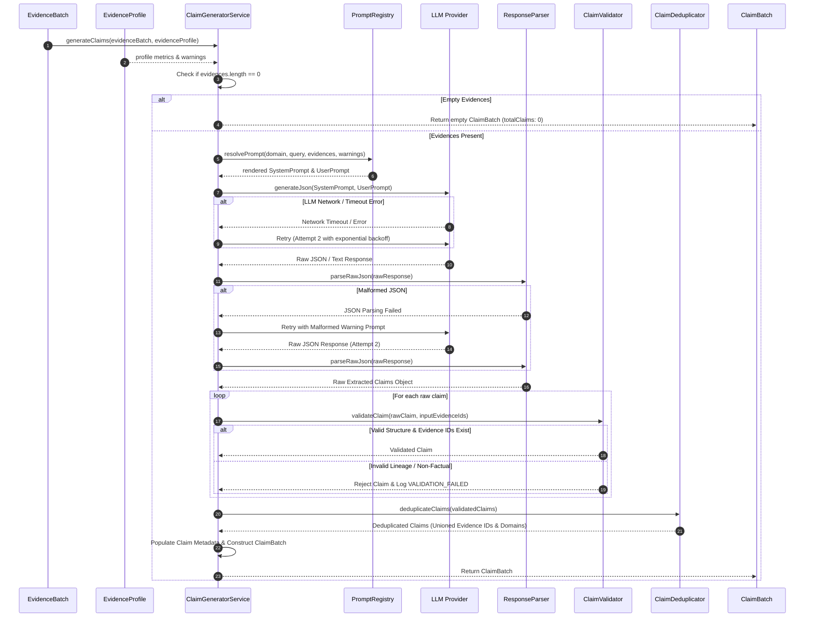

# TruthForge-AI Claim Generator Architecture & Specification

## Executive Summary

This document details the architectural design, data contracts, prompting strategies, and implementation specification for **Phase 2: Claim Generator** of **TruthForge-AI**.

The **Claim Generator** is a core component of the TruthForge-AI pipeline positioned immediately downstream of the **Evidence Profiling Engine**. Its sole primary responsibility is to transform normalized, profiled evidence snippets into an array of atomic, structured, fact-based claims mapped directly to supporting evidence IDs.

---

## Pipeline Position & Module Scope

### End-to-End Verification Pipeline Context

```text
User Query
    ↓
Query Analyzer
    ↓
Deterministic Domain Scraper
    ↓
Retrieval Model
    ↓
Evidence Ingestion Module
    ↓
Evidence Profiling Engine
    ↓
Claim Generator  <--- [ DESIGNED IN THIS SPECIFICATION ]
    ↓
Claim Verifier
    ↓
Source Authenticity Evaluator
    ↓
Evidence Lineage Tracker
    ↓
Confidence Engine
    ↓
Report Generator
```

### Primary Responsibility Matrix

| Scope Category | Module Boundaries |
| :--- | :--- |
| **PRIMARY RESPONSIBILITY** | **Transform normalized evidence into a list of structured factual claims.** |
| **ALLOWED OPERATIONS** | • Extract atomic factual statements from normalized evidence.<br>• Split compound sentences into single-fact atomic claims.<br>• Reference source evidence IDs (`supportingEvidenceIds`) and source domains (`sourceDomains`).<br>• Merge semantically identical claims across evidence items.<br>• Retain conflicting factual claims as distinct separate claims.<br>• Populate rich claim execution metadata. |
| **PROHIBITED OPERATIONS** | **DO NOT Verify claims** (Reserved for *Claim Verifier*).<br>**DO NOT Assign confidence scores** (Reserved for *Confidence Engine*).<br>**DO NOT Judge source credibility** (Reserved for *Source Authenticity Evaluator*).<br>**DO NOT Rank sources** (Reserved for *Retrieval Model* / *Source Authenticity Evaluator*).<br>**DO NOT Generate summaries or synthesis** (Reserved for *Report Generator*).<br>**DO NOT Generate final reports** (Reserved for *Report Generator*). |

---

## Module Folder Structure & Component Breakdown

The Claim Generator is implemented cleanly within the backend architecture under `backend/src/modules/claims/`.

```text
backend/src/modules/claims/
├── contracts/                  # Data interfaces & schema definitions
│   ├── evidenceBatch.contract.js   # Input EvidenceBatch interface definition
│   ├── evidenceProfile.contract.js # Input EvidenceProfile interface definition
│   └── claimBatch.contract.js      # Output Claim & ClaimBatch interfaces
├── models/                     # Internal domain models & value objects
│   ├── claim.model.js              # Claim domain entity class & factory methods
│   └── claimBatch.model.js         # ClaimBatch domain entity container
├── providers/                  # LLM provider abstractions & vendor adapters
│   ├── llmProvider.interface.js    # Abstract LLM provider interface contract
│   ├── openAiProvider.js           # OpenAI API adapter implementation
│   ├── anthropicProvider.js        # Anthropic Claude API adapter implementation
│   ├── geminiProvider.js           # Google Gemini API adapter implementation
│   └── providerFactory.js          # Dynamic provider selection factory
├── prompts/                    # System & User prompt templates & registries
│   ├── systemPrompts.js            # Standard & domain-specific system prompts
│   ├── userPrompts.js              # Dynamic user prompt generator templates
│   └── promptRegistry.js           # Domain prompt selector (Medical, Legal, etc.)
├── parsers/                    # LLM response parsing & formatting
│   ├── jsonResponseParser.js       # Safe JSON extractor & sanitizer
│   └── claimParser.js              # Raw LLM JSON to internal domain object converter
├── validators/                 # Verification & validation guards
│   ├── schemaValidator.js          # Structural JSON schema validator
│   ├── lineageValidator.js         # Evidence ID existence & boundary checker
│   └── contentValidator.js        # Atomic claim quality & non-speculation checks
├── utils/                      # Internal module helper utilities
│   ├── claimDeduplicator.js        # Semantic & exact claim deduplication engine
│   └── textNormalizer.js           # String canonicalization & hashing helpers
└── services/                   # Core orchestrator service
    └── claimGenerator.service.js   # Main pipeline service orchestrating generation flow
```

### Component Responsibility Breakdown

1. **`contracts/`**: Defines strict TypeScript/JSDoc data shapes for inputs (`EvidenceBatch`, `EvidenceProfile`) and outputs (`Claim`, `ClaimBatch`), ensuring decoupled inter-module communication.
2. **`models/`**: Encapsulates domain logic for claims, immutability, and state transformations.
3. **`providers/`**: Implements the Provider Pattern via `LLMProviderInterface`. Decouples LLM vendors (OpenAI, Gemini, Anthropic, Ollama) from business logic.
4. **`prompts/`**: Houses version-controlled prompt templates with strict operational constraints, supporting domain-specific prompt resolution via `PromptRegistry`.
5. **`parsers/`**: Extracts, cleanses, and parses raw text outputs into structured JSON, handling markdown code fences (````json ... ````) and malformed tokens.
6. **`validators/`**: Executes multi-stage validation ensuring statements are non-empty, evidence IDs exist in input batches, and invalid references are stripped.
7. **`utils/`**: Implements exact string canonicalization and semantic vector/Jaccard claim deduplication algorithms.
8. **`services/claimGenerator.service.js`**: The main workflow orchestrator driving input extraction, prompt rendering, provider invocation, parsing, validation, deduplication, and batch assembly.

---

## Data Contracts & Schemas

### 1. Input Contracts

#### `EvidenceBatch` Contract
```javascript
/**
 * @typedef {Object} EvidenceItem
 * @property {string} evidenceId - Unique ID assigned during ingestion (e.g. "evidence-1")
 * @property {string} text - Cleaned, normalized evidence snippet
 * @property {string} sourceUrl - Full source URL of evidence
 * @property {string} sourceDomain - Derived domain (e.g. "who.int")
 * @property {number} semanticScore - Retrieval relevance score [0.0 - 1.0]
 * @property {number} retrievalScore - Scraper rank score
 * @property {Object} metadata - Ingestion timestamps and source meta
 */

/**
 * @typedef {Object} EvidenceBatch
 * @property {string} batchId - Unique ID of the evidence batch
 * @property {string} queryId - Root pipeline user query ID
 * @property {string} query - The exact user search query statement
 * @property {EvidenceItem[]} evidences - Array of normalized evidence items
 * @property {string[]} sourceUrls - Distinct list of source URLs
 * @property {Object} metadata - Batch creation & provider context
 */
```

#### `EvidenceProfile` Contract
```javascript
/**
 * @typedef {Object} QualityWarning
 * @property {string} code - Warning identifier (e.g. "LOW_SOURCE_DIVERSITY")
 * @property {string} severity - "CRITICAL" | "WARNING" | "INFO"
 * @property {string} message - Descriptive warning text
 */

/**
 * @typedef {Object} EvidenceProfile
 * @property {string} profileId - Unique ID of the profile
 * @property {string} batchId - Reference to target EvidenceBatch
 * @property {number} totalEvidences - Total valid items in batch
 * @property {number} distinctSourcesCount - Unique source domains count
 * @property {QualityWarning[]} qualityWarnings - List of detected quality flags
 * @property {Object} healthMetrics - Quantified batch health & noise metrics
 */
```

### 2. Output Contracts

#### `Claim` Contract
```javascript
/**
 * @typedef {Object} ClaimMetadata
 * @property {number} evidenceCount - Number of supporting evidence items linked
 * @property {number} sourceCount - Number of distinct source domains linked
 * @property {string} generatedBy - Model provider identifier (e.g. "openai/gpt-4o")
 * @property {string} generationTimestamp - ISO 8601 UTC timestamp of creation
 * @property {number} [deduplicatedFromCount] - Number of duplicate claims merged into this claim
 * @property {string[]} [originalStatements] - Pre-deduplication statements if merged
 */

/**
 * @typedef {Object} Claim
 * @property {string} claimId - Deterministic UUID or prefix ID (e.g. "claim-a1b2c3d4")
 * @property {string} statement - Concise, atomic factual statement
 * @property {string[]} supportingEvidenceIds - Array of valid evidence IDs (e.g. ["evidence-2", "evidence-9"])
 * @property {string[]} sourceDomains - Array of distinct source domains (e.g. ["who.int", "cdc.gov"])
 * @property {string} generatedAt - ISO 8601 string timestamp
 * @property {ClaimMetadata} metadata - Operational metrics & lineage context
 */
```

#### `ClaimBatch` Contract
```javascript
/**
 * @typedef {Object} ClaimBatch
 * @property {string} batchId - Unique claim batch identifier
 * @property {string} queryId - Root pipeline user query ID
 * @property {string} query - The exact user search query statement
 * @property {number} totalClaims - Total validated claims in batch
 * @property {Claim[]} claims - Array of structured claim objects
 * @property {Object} executionSummary - Execution runtime statistics
 */
```

---

## Detailed Prompting Strategy

### 1. System Prompt

```text
You are the Claim Generator Module for TruthForge-AI, a precision AI research verification system.

YOUR SINGLE TASK:
Extract atomic, independent, factual statements directly supported by the provided evidence snippets.

STRICT EXTRACTION RULES:
1. FACT-BASED ONLY: Extract only objective factual statements present in the text.
2. ZERO SPECULATION: Do NOT infer, extrapolate, assume, project, or synthesize facts not explicitly stated.
3. NO RECOMMENDATIONS / OPINIONS: Exclude all advice, value judgements, subjective opinions, or editorial remarks.
4. ATOMIC GRANULARITY: Every claim MUST express exactly ONE single fact. Split compound statements joined by conjunctions (and, also, as well as, furthermore) into multiple independent claims.
5. NO HALLUCINATIONS: Do NOT introduce external knowledge, facts, or context outside the provided evidence.
6. EVIDENCE LINKING: Every claim MUST cite the exact evidence ID(s) (e.g., "evidence-1") that explicitly state the fact.
7. SCIENTIFIC TERMINOLOGY: Preserve technical, scientific, medical, and legal terminology exactly as written in the evidence.
8. CONTRADICTIONS: If different evidence items present conflicting facts, extract them as separate, independent claims. Do NOT try to reconcile contradictions.
9. INSUFFICIENT EVIDENCE: If an evidence snippet contains no verifiable facts or is completely off-topic, do NOT generate any claim from it.

OUTPUT FORMAT REQUIREMENTS:
- You must output valid JSON matching the specified JSON Schema.
- No markdown code blocks surrounding the JSON unless requested, no conversational text before or after.
```

### 2. User Prompt Template

```text
USER QUERY:
"${query}"

EVIDENCE PROFILING CONTEXT:
- Total Snippets Provided: ${evidences.length}
- Profile Quality Warnings: ${qualityWarnings.map(w => w.code + ": " + w.message).join("; ") || "NONE"}

INPUT EVIDENCE LIST:
${evidences.map(e => `[ID: ${e.evidenceId}] [Domain: ${e.sourceDomain}]\nText: "${e.text}"`).join("\n\n")}

TASK:
Extract all atomic factual claims supported by the evidence above.

Return a JSON object structured exactly as follows:
{
  "extractedClaims": [
    {
      "statement": "<Single atomic factual statement>",
      "supportingEvidenceIds": ["<evidenceId_1>", "<evidenceId_2>"]
    }
  ]
}
```

### 3. LLM Output JSON Schema

```json
{
  "$schema": "http://json-schema.org/draft-07/schema#",
  "type": "object",
  "required": ["extractedClaims"],
  "additionalProperties": false,
  "properties": {
    "extractedClaims": {
      "type": "array",
      "items": {
        "type": "object",
        "required": ["statement", "supportingEvidenceIds"],
        "additionalProperties": false,
        "properties": {
          "statement": {
            "type": "string",
            "minLength": 10,
            "maxLength": 300
          },
          "supportingEvidenceIds": {
            "type": "array",
            "minItems": 1,
            "items": {
              "type": "string"
            }
          }
        }
      }
    }
  }
}
```

---

## Claim Generation Rules & Deduplication Strategy

### 1. Granularity & Atomicity Rule

Compound claims **MUST** be decomposed.

* **Non-Atomic (Bad)**:
  `"Contaminated water spreads infectious diseases and negatively impacts agricultural yields."`
* **Decomposed Atomic Claims (Good)**:
  * **Claim 1**: `"Contaminated water spreads infectious diseases."` (`supportingEvidenceIds`: `["evidence-2"]`)
  * **Claim 2**: `"Poor water quality negatively affects agricultural yields."` (`supportingEvidenceIds`: `["evidence-5"]`)

### 2. Evidence Lineage Rule

Claims reference `evidenceId` strings, **never** raw text snippets. This ensures upstream traceability without duplicating large text payloads across pipeline stages.

```json
{
  "claimId": "claim-8f3a12b4",
  "statement": "Contaminated water spreads infectious diseases.",
  "supportingEvidenceIds": ["evidence-2", "evidence-9"],
  "sourceDomains": ["who.int", "cdc.gov"]
}
```

### 3. Claim Deduplication Strategy

When different evidence snippets yield semantically identical or nearly identical factual statements, the Claim Generator merges them into a single canonical claim while unioning their evidence references and source domains.

#### Deduplication Workflow

```text
Raw Extracted Claims
        ↓
Canonicalization (Lowercase, Stripping Punctuation, Whitespace Trimming)
        ↓
Exact Match Hash Grouping (SHA-256 Hash of Canonical Statement)
        ↓
Semantic Similarity Match (Jaccard N-Gram Similarity >= 0.85 OR Cosine Vector Similarity >= 0.88)
        ↓
Merge Statements → Union supportingEvidenceIds & sourceDomains → Increment deduplicatedFromCount
```

#### Example Deduplication Transformation

* **Claim Candidate A**: `"Unsafe drinking water transmits infectious diseases."` (`["evidence-1"]`, `["cdc.gov"]`)
* **Claim Candidate B**: `"Contaminated water causes transmission of infectious disease."` (`["evidence-4"]`, `["who.int"]`)

**Deduplicated Output Claim**:
```json
{
  "claimId": "claim-c4e910a2",
  "statement": "Unsafe drinking water transmits infectious diseases.",
  "supportingEvidenceIds": ["evidence-1", "evidence-4"],
  "sourceDomains": ["cdc.gov", "who.int"],
  "generatedAt": "2026-07-26T00:35:00.000Z",
  "metadata": {
    "evidenceCount": 2,
    "sourceCount": 2,
    "generatedBy": "openai/gpt-4o",
    "generationTimestamp": "2026-07-26T00:35:00.000Z",
    "deduplicatedFromCount": 2,
    "originalStatements": [
      "Unsafe drinking water transmits infectious diseases.",
      "Contaminated water causes transmission of infectious disease."
    ]
  }
}
```

### 4. Contradictory Evidence Strategy

If two evidence snippets contain opposing facts, **both claims must be generated as separate claims**.

* **Claim A**: `"Drug X reduced patient recovery time in clinical trials."` (`["evidence-3"]`)
* **Claim B**: `"Drug X showed no statistically significant effect on recovery time in clinical trials."` (`["evidence-7"]`)

The Claim Generator **does not resolve, rank, or filter out contradictions**. Downstream modules (*Claim Verifier* and *Confidence Engine*) evaluate evidence quality and resolve conflicts.

---

## Multi-Stage Validation Strategy

Before any `ClaimBatch` leaves the module, all generated claims must pass through a 4-tier validation pipeline (`validators/`):

```text
Raw Extracted Claims
        ↓
1. Structural Validation (Schema & Type Integrity)
        ↓
2. Evidence Lineage Validation (Referential Integrity Guard)
        ↓
3. Content & Quality Validation (Speculation & Atomicity Checks)
        ↓
4. Deduplication & Consolidation
        ↓
Validated ClaimBatch
```

| Tier | Validator | Validation Check Description | Action on Failure |
| :--- | :--- | :--- | :--- |
| **1** | `schemaValidator.js` | Verifies statement is non-empty string, length >= 10 chars, `supportingEvidenceIds` is non-empty array. | Discard invalid claim structure. |
| **2** | `lineageValidator.js` | Cross-references every ID in `supportingEvidenceIds` against the input `EvidenceBatch.evidences`. Filters out hallucinated IDs. | Strip non-existent IDs. If 0 valid IDs remain, discard claim. |
| **3** | `contentValidator.js` | Checks for subjective/speculative indicators ("I think", "probably", "in my opinion", "should consider"). | Discard non-factual claim. |
| **4** | `claimDeduplicator.js` | Merges semantically identical statements and unions supporting evidence & domains. | Consolidate into canonical claim. |

---

## Failure Handling & Fault Tolerance

The pipeline **must never crash** due to LLM errors, parsing failures, or edge cases.

```text
        LLM Execution
              │
     ┌────────┴────────┐
   Success           Failure / Error
     │                 │
Parse JSON           Determine Error Type
     │                 │
  Success ───┐     ┌───┴─────────────────────────────┐
             │  Malformed JSON    Timeout/Outage  Invalid Ref IDs
             │     │                     │               │
             │  Fallback Regex     Exponential       Filter Bad IDs
             │  JSON Extractor     Backoff Retry     (Lineage Check)
             │     │                     │               │
             │  Retry w/ Hint     Fallback Error         │
             │     │                 Contract            │
             └─────┼─────────────────────┴───────────────┘
                   ▼
       Validated ClaimBatch Output
```

### Resilience Protocols

1. **Empty Input Evidence**: If `EvidenceBatch.evidences` is empty (`totalEvidences === 0`), return an empty `ClaimBatch` (`totalClaims: 0, claims: []`) immediately without invoking the LLM provider.
2. **Malformed LLM JSON**:
   * *Attempt 1*: Execute `jsonResponseParser.js` regex to strip conversational preamble or markdown code blocks (````json ... ````).
   * *Attempt 2*: If JSON parsing fails, trigger 1 retry to LLM with an additional system warning: `"YOUR PREVIOUS OUTPUT WAS MALFORMED JSON. OUTPUT ONLY RAW VALID JSON."`
   * *Attempt 3*: If retry fails, return empty claims array and log `PARSING_FAILURE`.
3. **No Claims Extracted**: If the LLM determines no factual claims exist in the evidence, return an empty `ClaimBatch` (`totalClaims: 0`). This is a valid operational result.
4. **Invalid / Hallucinated Evidence IDs**: `lineageValidator.js` filters out evidence IDs that do not exist in the input `EvidenceBatch`. If a claim ends up with zero valid IDs, it is discarded.
5. **Timeout & Provider Outage**: LLM invocations are wrapped in a configurable timeout (default 15,000 ms) with 2 exponential backoff retries. If all retries fail, return a fallback `ClaimBatch` with error diagnostic flags in execution summary.

---

## Logging & Observability Strategy

All events use structured JSON logging via the centralized system logger (`backend/src/utils/logger.js`).

### Event Catalog

| Event Name | Level | Trigger Condition | Sample Payload Keywords |
| :--- | :--- | :--- | :--- |
| `CLAIM_GENERATION_STARTED` | `INFO` | Workflow initiated | `batchId`, `queryId`, `totalEvidences`, `provider` |
| `CLAIM_GENERATION_COMPLETED` | `INFO` | Generation finished successfully | `batchId`, `totalClaims`, `executionTimeMs`, `dedupCount` |
| `CLAIM_CREATED` | `DEBUG` | Individual claim created | `claimId`, `statementSnippet`, `evidenceCount` |
| `CLAIM_DEDUPLICATED` | `DEBUG` | Two claims merged | `canonicalClaimId`, `mergedClaimId`, `evidenceUnionCount` |
| `INVALID_MODEL_OUTPUT` | `WARN` | LLM returned non-schema output | `rawSnippet`, `parseError` |
| `LLM_RETRY` | `WARN` | Retry initiated for LLM call | `attempt`, `reason`, `delayMs` |
| `PARSING_FAILURE` | `ERROR` | Unrecoverable JSON parse error | `rawResponse`, `error` |
| `VALIDATION_FAILED` | `WARN` | Claim failed lineage/quality check | `claimId`, `ruleFailed`, `details` |

### Structured Log Schema Examples

```json
{
  "timestamp": "2026-07-26T00:35:01.120Z",
  "level": "INFO",
  "stage": "Claim Generation",
  "event": "CLAIM_GENERATION_STARTED",
  "queryId": "q-98765",
  "batchId": "eb-12345",
  "totalEvidences": 12,
  "provider": "openai/gpt-4o"
}
```

```json
{
  "timestamp": "2026-07-26T00:35:03.450Z",
  "level": "INFO",
  "stage": "Claim Generation",
  "event": "CLAIM_CREATED",
  "queryId": "q-98765",
  "batchId": "eb-12345",
  "claimId": "claim-7a8b9c",
  "statement": "Contaminated water spreads infectious diseases.",
  "evidenceCount": 2,
  "sourceDomains": ["who.int", "cdc.gov"]
}
```

---

## Sequence Flow Diagram



---

## Future Extensibility Architecture

The Claim Generator design isolates internal components to support future enhancements without breaking downstream modules (*Claim Verifier*, *Confidence Engine*, *Report Generator*):

### 1. Multilingual Evidence Processing
* **Strategy**: `PromptRegistry` dynamically injects language-agnostic extraction instructions or localized system prompts based on `EvidenceProfile.detectedLanguage`.
* **Downstream Contract**: Downstream modules continue to receive standard `Claim` objects regardless of evidence source language.

### 2. Multi-LLM Provider Abstraction
* **Strategy**: Provider Factory (`providers/providerFactory.js`) implements `LLMProviderInterface`. Switching between OpenAI, Anthropic, Gemini, or local open-source models (Ollama/vLLM) requires only an environment flag (`CLAIM_LLM_PROVIDER=anthropic`).

```javascript
// Provider Factory Pattern Interface
class LLMProviderInterface {
  async generateJson(systemPrompt, userPrompt, jsonSchema) {
    throw new Error("Method generateJson() must be implemented.");
  }
}
```

### 3. Streaming Claim Generation
* **Strategy**: The `claimParser.js` and `jsonResponseParser.js` are designed to support chunk-based JSON stream parsing (using `stream-json` or custom async generators).
* **Benefit**: Downstream modules can begin processing initial claims before the LLM finishes generating the complete batch.

### 4. Batched Evidence Processing for Large Contexts
* **Strategy**: If `EvidenceBatch.evidences` exceeds model context window limits, `claimGenerator.service.js` automatically splits evidence into sub-batches, executes parallel extraction, and passes all sub-batch claims through `claimDeduplicator.js`.

### 5. Domain-Specific Custom Prompts
* **Strategy**: `PromptRegistry` inspects query classification metadata (e.g. `domain: "medical" | "legal" | "scientific"`) to inject specialized extraction instructions (e.g. medical trial dosage terminology, legal statute citations).

---

## Verification & Architecture Checklist

- [x] **Primary Responsibility Defined**: Explicit focus on normalized evidence → structured claim transformation.
- [x] **Prohibited Actions Explicit**: No verification, confidence scoring, source credibility, source ranking, or reporting.
- [x] **Data Contracts Specified**: Full TypeScript/JSDoc types for `EvidenceBatch`, `EvidenceProfile`, `Claim`, and `ClaimBatch`.
- [x] **Prompting Strategy Fully Detailed**: Complete System Prompt, User Prompt template, JSON Schema, and Metadata rules.
- [x] **Deduplication Strategy Documented**: String canonicalization, exact hashing, semantic similarity, and ID unioning.
- [x] **Contradiction Strategy Specified**: Separate claims generated; no attempt to resolve conflicts.
- [x] **Resilience & Fault Tolerance**: Retry logic, malformed JSON fallback, empty evidence handling, and lineage guards.
- [x] **Structured Logging Matrix**: Detailed JSON log formats and event lifecycle catalog.
- [x] **Sequence Diagram Included**: Clear Mermaid flow illustrating end-to-end component interaction.
- [x] **Future Extensibility Built-in**: Support for multi-LLM, multilingual, streaming, batching, and domain prompts.
