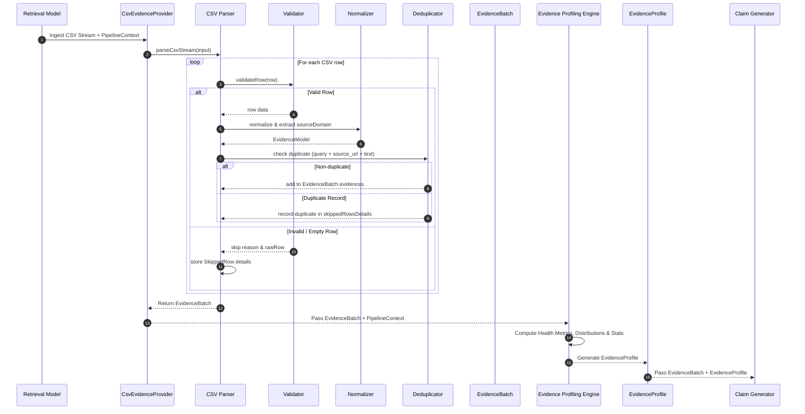

# TruthForge-AI Evidence Ingestion & Profiling Architecture

## Executive Summary

This document details the architectural design and technical specification of the **Evidence Ingestion Module** and the **Evidence Profiling Engine** for **TruthForge-AI**.

As the first stage of the internal research verification pipeline, this module ingests raw CSV files produced internally by the **Retrieval Model** (following deterministic domain scraping), validates and normalizes evidence snippets, deduplicates records, preserves diagnostic skip details, enriches evidence batches with pipeline context, and profiles batch characteristics using independent descriptive metrics.

---

## Pipeline Position & End-to-End Context

The Evidence Ingestion Module and Evidence Profiling Engine function exclusively as internal pipeline components. They do **not** expose public HTTP endpoints, accept user multipart uploads, or perform database write operations.

Processing produces an in-memory `EvidenceBatch` and an `EvidenceProfile` that flow directly to downstream verification stages.

### End-to-End Verification Pipeline

```text
User Query
        ↓
Query Analyzer
        ↓
Deterministic Domain Scraper
        ↓
Retrieval Model
        ↓
CsvEvidenceProvider
        ↓
CSV Parser
        ↓
Validator
        ↓
Normalizer
        ↓
Deduplicator
        ↓
EvidenceBatch
        ↓
Evidence Profiling Engine
        ↓
EvidenceProfile
        ↓
Claim Generator
        ↓
Claim Verifier
        ↓
Source Authenticity Evaluator
        ↓
Evidence Lineage Tracker
        ↓
Confidence Engine
        ↓
Report Generator
```

---

## Runtime Execution Sequence Flow



---

## Architectural Guiding Principles & Responsibilities

1. **Single Responsibility & Strict Non-Judicial Profiling**:
   - The **Evidence Profiling Engine** is strictly profiling and descriptive in nature.
   - It computes distributions, calculates statistical measures, detects anomalies, and emits diagnostic warnings.
   - It must **never** judge correctness, score credibility, verify claims, or determine source trust. Those responsibilities belong exclusively to later pipeline stages (e.g., Claim Verifier, Source Authenticity Evaluator, Confidence Engine).

2. **No Composite Quality Score**:
   - The profiling engine does **not** combine metrics into a single composite score (`qualityScore`).
   - Instead, it exposes independent, unweighted descriptive metrics (`healthMetrics`) for downstream engines to evaluate according to their own domain rules.

3. **Provider Pattern Abstraction (`EvidenceProvider`)**:
   - Abstract contract `EvidenceProvider` defining `ingest(input, options): Promise<EvidenceBatch>`.
   - Concrete implementation `CsvEvidenceProvider` wrapping streaming CSV parsing.
   - Downstream pipeline modules remain agnostic of evidence origin (CSV, JSON, PubMed API, or Web Scraper).

4. **Context Traceability (`PipelineContext`)**:
   - Every `EvidenceBatch` is bound to a `PipelineContext` object (`pipelineRunId`, `query`, `retrievalModel`, `generatedAt`, `retrievalExecutionTime`).
   - Downstream modules can trace origin and execution context without requiring extra method arguments.

5. **Diagnostic Transparency (`SkippedRow`)**:
   - Raw skipped rows (row numbers, reason strings, and unparsed raw row data) are preserved inside `EvidenceBatch.skippedRowsDetails` for debugging and lineage diagnostics.

6. **Memory-Efficient Streaming Execution**:
   - Parses CSV streams chunk-by-chunk using Node.js readable streams with minimal memory overhead.

---

## Module Directory & File Structure

```text
backend/src/modules/evidence/
├── models/
│   └── evidence.model.js               # Evidence domain entity & metadata constructor
├── utils/
│   └── csvValidator.js                 # Header & row-level field validation utilities
├── parser/
│   └── csvParser.js                    # Streaming CSV reader, deduplicator & logger
├── providers/
│   ├── evidenceProvider.interface.js   # Abstract EvidenceProvider base interface
│   └── csvEvidenceProvider.js          # CsvEvidenceProvider implementation
└── services/
    └── evidenceProfilingEngine.service.js # Evidence Profiling Engine service
```

---

## Data Models & Interface Contracts

### 1. Evidence Domain Entity (`Evidence`)
Located in [`backend/src/modules/evidence/models/evidence.model.js`](file:///c:/TruthForge-AI/backend/src/modules/evidence/models/evidence.model.js)

```typescript
interface Evidence {
    id: string;             // UUID (crypto.randomUUID())
    query: string;          // Cleaned research query
    sourceUrl: string;      // Validated source URL
    sourceDomain: string;   // Hostname extracted once during ingestion (e.g. "niehs.nih.gov")
    semanticScore: number;  // Float in range [0, 1]
    retrievalScore: number; // Float in range [0, 1] (mapped from CSV 'score')
    bonus: number;          // Float bonus score (defaults to 0)
    text: string;           // Evidence text snippet
    rowNumber: number;      // 1-based CSV line number
    importedAt: Date;       // Ingestion timestamp
    metadata: {
        provider: string;           // e.g. "CSV"
        providerVersion: string;    // e.g. "1.0.0"
        generatedBy: string;        // e.g. "RetrievalModel-v2"
        ingestionTimestamp: Date;
        [key: string]: any;
    };
}
```

### 2. Diagnostic Skipped Row (`SkippedRow`)
```typescript
interface SkippedRow {
    rowNumber: number;
    reason: string;
    rawRow: Record<string, any> | string;
}
```

### 3. Pipeline Context (`PipelineContext`)
```typescript
interface PipelineContext {
    pipelineRunId: string;
    query: string;
    retrievalModel: string;
    generatedAt: Date;
    retrievalExecutionTime: number;
}
```

### 4. Evidence Batch (`EvidenceBatch`)
```typescript
interface EvidenceBatch {
    pipelineContext: PipelineContext;
    totalRows: number;
    validRows: number;
    skippedRows: number;
    duplicateRows: number;
    processingTimeMs: number;
    fileMetadata: {
        filename?: string;
        checksum?: string;
        encoding?: string;
        importedAt: Date;
    };
    skippedRowsDetails: SkippedRow[];
    evidences: Evidence[];
}
```

### 5. Evidence Profile (`EvidenceProfile`)
```typescript
interface EvidenceProfile {
    healthMetrics: {
        validityRatio: number;      // validRows / totalRows
        duplicateRatio: number;     // duplicateRows / totalRows
        semanticStrength: number;   // mean semantic score
        retrievalStrength: number;  // mean retrieval score
        domainDiversity: number;    // uniqueDomainCount / validRows
    };
    distributions: {
        semanticScoreDistribution: {
            '0.00-0.25': number;
            '0.25-0.50': number;
            '0.50-0.75': number;
            '0.75-1.00': number;
        };
        retrievalScoreDistribution: {
            '0.00-0.25': number;
            '0.25-0.50': number;
            '0.50-0.75': number;
            '0.75-1.00': number;
        };
        semanticStats: {
            minimumSemanticScore: number;
            maximumSemanticScore: number;
            medianSemanticScore: number;
            semanticScoreStandardDeviation: number;
        };
        retrievalStats: {
            minimumRetrievalScore: number;
            maximumRetrievalScore: number;
            medianRetrievalScore: number;
            retrievalScoreStandardDeviation: number;
        };
    };
    topDomains: Array<{ domain: string; count: number }>;
    warnings: string[];
}
```

---

## Validation & Processing Rules

### Header Requirements
The input CSV must contain all required column headers:
- `query`
- `source_url`
- `semantic_score`
- `score`
- `text`
- `bonus` *(Optional, defaults to 0)*

Missing required headers cause immediate parser termination with a `BadRequestError`.

### Row Field Validation
- `query`: Required string, max length 500 characters.
- `source_url`: Required valid HTTP/HTTPS URL.
- `semantic_score`: Required number in range `[0.0, 1.0]`.
- `score` *(mapped to `retrievalScore`)*: Required number in range `[0.0, 1.0]`.
- `bonus`: Optional number (defaults to `0`).
- `text`: Required, non-empty string.
- Invalid rows are recorded in `skippedRowsDetails` with row number, reason, and raw row content without halting the pipeline.

---

## Evidence Profiling Engine Metrics

Located in [`backend/src/modules/evidence/services/evidenceProfilingEngine.service.js`](file:///c:/TruthForge-AI/backend/src/modules/evidence/services/evidenceProfilingEngine.service.js)

The Profiling Engine analyzes the `EvidenceBatch` and returns an `EvidenceProfile` containing:

1. **Independent Health Metrics (`healthMetrics`)**:
   - `validityRatio`: Ratio of valid rows to total rows ($validRows / totalRows$).
   - `duplicateRatio`: Ratio of duplicate rows to total rows ($duplicateRows / totalRows$).
   - `semanticStrength`: Arithmetic mean of valid semantic scores.
   - `retrievalStrength`: Arithmetic mean of valid retrieval scores.
   - `domainDiversity`: Ratio of unique domain hostnames to valid evidence items ($uniqueDomainCount / validRows$).

2. **Distribution & Statistical Metrics (`distributions`)**:
   - **Histograms**: Binned counts across `[0.00-0.25)`, `[0.25-0.50)`, `[0.50-0.75)`, `[0.75-1.00]`.
   - **Semantic Statistics**: Minimum, maximum, median, and standard deviation of `semanticScore`.
   - **Retrieval Statistics**: Minimum, maximum, median, and standard deviation of `retrievalScore`.

3. **Top Domains Ranking (`topDomains`)**:
   - Frequency distribution of top contributing source domains.

4. **Diagnostic Warnings (`warnings`)**:
   - Alerts for anomalies such as high duplicate ratios, low validity ratios, or low domain diversity.

---

## Future Compatibility & Provider Extensions

Adding new evidence sources (e.g. JSON files, PubMed API, Web Scraper) requires implementing the `EvidenceProvider` interface:

```javascript
import { EvidenceProvider } from '../providers/evidenceProvider.interface.js';

export class PubMedEvidenceProvider extends EvidenceProvider {
  async ingest(input, options = {}) {
    // 1. Ingest from PubMed API
    // 2. Normalize records into EvidenceModel instances
    // 3. Return EvidenceBatch with PipelineContext and metadata
  }
}
```

Downstream pipeline stages (Claim Generator, Claim Verifier, Confidence Engine) consume `EvidenceBatch` and `EvidenceProfile` objects without requiring any modifications.
