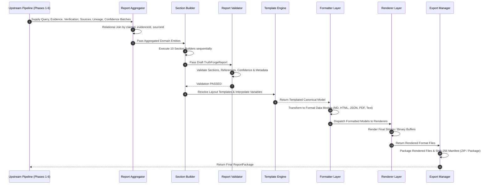

# TruthForge-AI Phase 7 – Explainable Report Generation Engine Architecture & Specification

## 1. Executive Summary

This document details the production-grade architectural design, technical specification, data contracts, component responsibilities, validation rules, formatting/rendering pipeline, sequence flows, configuration schema, and testing strategy for **Phase 7 – Explainable Report Generation Engine** of **TruthForge-AI**.

The **Explainable Report Generation Engine** serves as the final synthesis and presentation layer of the TruthForge-AI pipeline. It consumes structured outputs from all six upstream pipeline stages—Query Analysis, Evidence Ingestion & Profiling, Claim Generation (Phase 2), Claim Verification (Phase 3), Source Authenticity Evaluation (Phase 4), Evidence Lineage Engine (Phase 5), and Explainable Confidence Engine (Phase 6)—and transforms them into deterministic, human-readable, auditable, multi-format report packages.

The engine operates under a **strictly deterministic, zero-LLM, template-driven paradigm** in its primary execution path. It acts strictly as an **explanation layer** and never as a reasoning engine. It does not verify claims, generate new claims, rewrite evidence, calculate confidence scores, evaluate source credibility, infer unstated facts, or hallucinate explanations. Given identical pipeline inputs, the engine produces **100% byte-identical reports** across execution environments.

---

## 2. Pipeline Position & Operational Scope

### 2.1 End-to-End System Context

```text
User Query
    │
    ▼
Query Analyzer
    │
    ▼
Deterministic Domain Scraper
    │
    ▼
Retrieval Model
    │
    ▼
Evidence Ingestion Module
    │
    ▼
Evidence Profiling Engine
    │
    ▼
Claim Generator (Phase 2)
    │
    ▼
Claim Verification (Phase 3)
    │
    ▼
Source Authenticity Evaluation (Phase 4)
    │
    ▼
Evidence Lineage Engine (Phase 5)
    │
    ▼
Explainable Confidence Engine (Phase 6)
    │
    ▼
Explainable Report Generation Engine (Phase 7)  <--- [ DESIGNED IN THIS SPECIFICATION ]
    │
    ▼
Report Package (JSON, Markdown, HTML, PDF, Plain Text, ZIP)
```

### 2.2 Input/Output Interfacing

- **Inputs Consumed**:
  1. `Query`: Initial query payload containing `queryId`, `queryString`, `domainContext`, `executionTimestamp`, and `userMetadata`.
  2. `EvidenceBatch`: Ingested evidence items with text snippets, vector embeddings, source URLs, and retrieval scores (Phase 1).
  3. `EvidenceProfile`: Semantic vector scores, coverage ratios, quality metrics, and text structure analysis (Phase 1).
  4. `VerificationBatch`: Array of verified claims with verification status (`SUPPORTED`, `PARTIALLY_SUPPORTED`, `CONTRADICTED`, `INSUFFICIENT_EVIDENCE`, `UNVERIFIABLE`), verification logic breakdown, and evidence citations (Phase 3).
  5. `SourceAuthenticityBatch`: Source profiles containing domain trust scores (0–100), TLD classifications, and authority tiers (`GOVERNMENT`, `ACADEMIC`, `MEDICAL`, `COMMERCIAL`, `UNKNOWN`) (Phase 4).
  6. `EvidenceLineageBatch`: Immutable provenance graph structures, root Merkle hashes, and claim-evidence linkage completeness metrics (Phase 5).
  7. `ConfidenceBatch`: Deterministic confidence scores (0–100), categorical levels (`VERY_HIGH`, `HIGH`, `MEDIUM`, `LOW`, `VERY_LOW`), sub-factor breakdowns, penalty logs, and natural-language explanation strings (Phase 6).

- **Outputs Produced**:
  - `ReportPackage`: Container object containing the canonical `TruthForgeReport` data model, an array of rendered format objects (`renderedFiles`), and execution metadata.

---

## 3. Module Responsibilities & Prohibitions

### 3.1 Primary Responsibility

The Explainable Report Generation Engine has **one and only one responsibility**:

> **Assemble a deterministic, explainable, human-readable report that faithfully represents the outputs of all previous pipeline stages.**

The report answers the question: **"What did the TruthForge-AI pipeline conclude, and exactly why?"**

### 3.2 Non-Responsibilities & Explicit Prohibitions

| Prohibited Operation | Rationale | Correct Pipeline Owner |
| :--- | :--- | :--- |
| **Claim Verification** | Must not alter, re-verify, or dispute claim truthfulness verdicts | Phase 3 (Claim Verification) |
| **Claim Generation** | Must not synthesize new claims or alter extracted claim statements | Phase 2 (Claim Generator) |
| **Evidence Rewriting** | Must not paraphrase, truncate, or rewrite raw evidence snippets | Phase 1 (Evidence Ingestion) |
| **Confidence Calculation**| Must not recompute confidence scores, weights, or penalties | Phase 6 (Confidence Engine) |
| **Source Evaluation** | Must not re-score domain authority, TLD credibility, or trust tiers | Phase 4 (Source Authenticity)|
| **Fact Inference** | Must not deduce new conclusions or extrapolate missing data | Strictly Prohibited |
| **Hallucination** | Must not use non-deterministic LLMs for report content generation | Strictly Prohibited |

---

## 4. Core Philosophy & Design Principles

### 4.1 Key Design Principles

1. **Deterministic & Reproducible**: Two identical pipeline input sets must yield 100% byte-identical report outputs across all execution environments.
2. **Explainable & Auditable**: Every statement in the report must trace directly back to explicit pipeline outputs from Phase 1 through Phase 6 with full line-by-line provenance.
3. **Template-Driven & Configurable**: Layouts, section ordering, formatting rules, and explanation strings are driven by externalized JSON configurations and templates without hardcoded UI strings.
4. **Format-Agnostic Core Logic**: Internal business logic operates exclusively on a canonical data model (`TruthForgeReport`), cleanly decoupled from downstream formatting and rendering engines.
5. **No Uncertainty Hiding**: System limitations, missing evidence, unverified claims, broken lineage paths, and penalties are explicitly highlighted in a dedicated Limitations section.

---

## 5. Layered Architecture & Processing Pipeline

The engine enforces a strict 8-layer processing hierarchy where data flows sequentially. Each layer performs a single dedicated function before passing results to the next.

```text
Pipeline Outputs (Phases 1-6)
        │
        ▼
Layer 1: Report Aggregator       <-- Ingests & joins cross-phase batches into coherent entities
        │
        ▼
Layer 2: Section Builder         <-- Constructs 10 deterministic canonical sections
        │
        ▼
Layer 3: Report Validator        <-- Performs structural, reference, & data integrity checks
        │
        ▼
Layer 4: Template Engine         <-- Resolves layout templates & interpolates variables
        │
        ▼
Layer 5: Formatter Layer         <-- Converts canonical model into format-specific representations
        │
        ▼
Layer 6: Renderer Layer          <-- Renders final strings/buffers for MD, HTML, JSON, PDF, Text
        │
        ▼
Layer 7: Export Manager          <-- Bundles outputs into multi-format ReportPackage / ZIP archive
```

---

## 6. Directory & Folder Structure

The implementation strictly follows Clean Architecture and modular encapsulation under `backend/src/modules/report/`:

```text
backend/src/modules/report/
├── contracts/
│   ├── reportInput.contract.js         # Validation schemas for Phase 1-6 input batches
│   ├── canonicalReport.contract.js     # TypeScript/JSDoc contracts for TruthForgeReport
│   └── reportPackage.contract.js       # Output package contract definitions
├── models/
│   ├── TruthForgeReport.js             # Canonical internal report domain entity
│   ├── ExecutiveSummary.js             # Executive summary domain model
│   ├── ClaimReport.js                  # Claim report item domain model
│   ├── ReportSection.js                # Report section structural model
│   └── ReportMetadata.js               # Report metadata entity
├── aggregators/
│   ├── ReportAggregator.js             # Master aggregator joining Phase 1-6 outputs
│   ├── ClaimEvidenceJoiner.js          # Cross-phase joiner for claims, evidence, & sources
│   └── MetricsAggregator.js            # Summary statistics calculator from pipeline data
├── builders/
│   ├── SectionBuilderFactory.js        # Instantiates section builders dynamically
│   ├── ExecutiveSummaryBuilder.js      # Builder for Section 1
│   ├── QueryContextBuilder.js          # Builder for Section 2
│   ├── OverallVerdictBuilder.js        # Builder for Section 3
│   ├── ClaimVerificationBuilder.js     # Builder for Section 4
│   ├── ConfidenceAnalysisBuilder.js    # Builder for Section 5
│   ├── EvidenceSummaryBuilder.js       # Builder for Section 6
│   ├── SourceAuthenticityBuilder.js    # Builder for Section 7
│   ├── ProvenanceSummaryBuilder.js     # Builder for Section 8
│   ├── LimitationsBuilder.js           # Builder for Section 9
│   └── AppendixBuilder.js              # Builder for Section 10
├── templates/
│   ├── TemplateRegistry.js             # Central registry for externalized report templates
│   ├── TemplateInterpolator.js         # Deterministic variable interpolation engine
│   ├── markdown/                       # Markdown template partials
│   ├── html/                           # HTML/Handlebars layout templates
│   └── text/                           # ASCII/Plain text template files
├── formatters/
│   ├── FormatterFactory.js             # Factory resolving formatters by format key
│   ├── MarkdownFormatter.js            # Converts canonical report to Markdown structure
│   ├── HTMLFormatter.js                # Converts canonical report to HTML DOM structure
│   ├── JSONFormatter.js                # Formats canonical report to clean JSON schema
│   ├── PDFFormatter.js                 # Prepares print-optimized layout structure for PDF
│   └── TextFormatter.js                # Prepares plain text ASCII formatted representation
├── renderers/
│   ├── RendererFactory.js              # Resolves active renderers
│   ├── MarkdownRenderer.js             # Serializes Markdown string
│   ├── HTMLRenderer.js                 # Renders HTML document with CSS & inline styles
│   ├── JSONRenderer.js                 # Stringifies formatted JSON with indent options
│   ├── PDFRenderer.js                  # Converts HTML/PDF stream into PDF binary buffer
│   └── TextRenderer.js                 # Renders plain text string
├── validators/
│   ├── ReportValidator.js              # Master multi-rule validator for TruthForgeReport
│   ├── SectionIntegrityValidator.js    # Validates required sections & sequence
│   ├── ReferenceValidator.js           # Verifies claim, evidence, & source ID cross-references
│   └── MetadataValidator.js            # Validates timestamps, versions, & execution metrics
├── exporters/
│   ├── ExportManager.js                # Coordinates multi-format rendering & packaging
│   ├── ZipExporter.js                  # Compresses output formats into single ZIP archive
│   └── FileArtifactExporter.js         # Writes rendered files to disk artifact storage
├── config/
│   ├── sections.json                   # Section enablement, titles, and ordering config
│   ├── templates.json                  # Externalized explanation templates & rules
│   ├── formats.json                    # Formatter/renderer mappings & MIME types
│   └── rules.json                      # Validation strictness and threshold settings
├── ai/
│   ├── AiEnhancementAdapter.js         # Optional facade for presentation rewrites
│   ├── ExecutiveSummaryRewriter.js     # Audience-level summary simplifier
│   └── LanguageAdapter.js              # Non-technical translation adapter
├── cache/
│   └── ReportCache.js                  # In-memory/Redis cache for rendered report packages
├── utils/
│   ├── deterministicHasher.js          # SHA-256 byte-identical hash verification helper
│   ├── formattingHelpers.js            # Number, percentage, & status formatting utilities
│   └── sanitizeHtml.js                 # HTML escaping & security sanitizer
└── docs/
    └── explainable_report_architecture.md # Architecture & specification documentation
```

---

## 7. Component Responsibilities

### 7.1 Report Aggregator (`aggregators/`)
Ingests raw output batches from upstream phases (`Query`, `EvidenceBatch`, `EvidenceProfile`, `VerificationBatch`, `SourceAuthenticityBatch`, `EvidenceLineageBatch`, `ConfidenceBatch`). Correlates records by `claimId`, `evidenceId`, and `sourceId` into unified internal entities.

### 7.2 Section Builder (`builders/`)
Executes an ordered pipeline of 10 deterministic section builders. Each builder consumes aggregated entities and populates a standardized `ReportSection` object.

### 7.3 Report Validator (`validators/`)
Verifies the structural integrity, completeness, and cross-reference validity of the canonical `TruthForgeReport` before formatting.

### 7.4 Template Engine (`templates/`)
Loads template definitions from `config/templates.json` and external files. Performs deterministic parameter substitution without invoking probabilistic models.

### 7.5 Formatter Layer (`formatters/`)
Transforms the canonical `TruthForgeReport` into format-specific data structures (e.g., preparing HTML DOM elements, Markdown ASTs, or ASCII grid layouts).

### 7.6 Renderer Layer (`renderers/`)
Serializes formatted representations into final string payloads or binary buffers (HTML, MD, JSON, PDF, TXT).

### 7.7 Export Manager (`exporters/`)
Packages single or multi-format rendered files alongside report metadata into a cohesive `ReportPackage` (or compressed ZIP archive).

### 7.8 Optional AI Enhancement Adapter (`ai/`)
Acts as a strict decorator around `TruthForgeReport`. Performs presentation-only adjustments (e.g., simplification for non-technical readers) while maintaining 100% fidelity to pipeline facts, confidence scores, and verdicts.

---

## 8. Data Contracts & Canonical Report Model

### 8.1 TypeScript & Contract Definitions

```typescript
export interface ReportMetadata {
  reportId: string;
  reportVersion: string;
  generatedAt: string;
  pipelineVersion: string;
  templateVersion: string;
  executionTimeMs: number;
  checksum: string;
}

export interface ExecutiveSummary {
  overallVerdict: 'FULLY_SUPPORTED' | 'PARTIALLY_SUPPORTED' | 'CONTRADICTED' | 'INSUFFICIENT_EVIDENCE' | 'MIXED_EVIDENCE';
  overallConfidence: number; // 0 - 100
  verifiedClaims: number;
  supportedClaims: number;
  contradictedClaims: number;
  insufficientClaims: number;
  totalEvidenceItems: number;
  uniqueSourcesUsed: number;
  highestAuthoritySources: string[];
}

export interface ClaimReport {
  claimId: string;
  claim: string;
  verificationStatus: 'SUPPORTED' | 'PARTIALLY_SUPPORTED' | 'CONTRADICTED' | 'INSUFFICIENT_EVIDENCE' | 'UNVERIFIABLE';
  confidence: number; // 0 - 100
  confidenceLevel: 'VERY_HIGH' | 'HIGH' | 'MEDIUM' | 'LOW' | 'VERY_LOW';
  supportingEvidence: string[];
  contradictingEvidence: string[];
  sourceProfiles: string[];
  explanation: string[];
  provenancePath: string[];
  penaltyCount: number;
}

export interface ReportSection {
  id: string;
  title: string;
  order: number;
  content: any; // Standardized section payload
}

export interface TruthForgeReport {
  metadata: ReportMetadata;
  executiveSummary: ExecutiveSummary;
  sections: ReportSection[];
}

export interface RenderedFile {
  format: 'markdown' | 'html' | 'json' | 'pdf' | 'text';
  filename: string;
  mimeType: string;
  content: string | Buffer;
  checksum: string; // SHA-256 hash of output
}

export interface ReportPackage {
  report: TruthForgeReport;
  renderedFiles: RenderedFile[];
  metadata: Record<string, any>;
}
```

---

## 9. Report Aggregation Strategy

The `ReportAggregator` maps disparate upstream data batches into unified domain records using relational join key strategies:

```text
                               ┌───────────────────────┐
                               │     Query Payload     │
                               └───────────┬───────────┘
                                           │
 ┌──────────────────────┐      ┌───────────▼───────────┐      ┌──────────────────────┐
 │  VerificationBatch   ├─────►│   ReportAggregator    │◄─────┤   ConfidenceBatch    │
 └──────────────────────┘      └───────────▲───────────┘      └──────────────────────┘
                                           │
 ┌──────────────────────┐                  │                  ┌──────────────────────┐
 │ EvidenceLineageBatch ├──────────────────┼─────────────────►│SourceAuthenticityBatch│
 └──────────────────────┘                  │                  └──────────────────────┘
                               ┌───────────┴───────────┐
                               │ EvidenceBatch/Profile │
                               └───────────────────────┘
```

### 9.1 Join Key Mapping Rules

1. **`claimId` Linkage**: Join `VerificationBatch.claims` with `ConfidenceBatch.claims` and `EvidenceLineageBatch.claims`.
2. **`evidenceId` Linkage**: For each claim, extract cited evidence IDs from `VerificationBatch` and link to `EvidenceBatch` snippets and `EvidenceProfile` quality scores.
3. **`sourceId` / Domain Linkage**: Extract source URLs from `EvidenceBatch`, normalize domain hostnames, and join with `SourceAuthenticityBatch` domain trust profiles.
4. **Lineage Node Linkage**: Trace claim root hashes to leaf evidence hashes via `EvidenceLineageBatch` DAG nodes.

---

## 10. Section Builder Design

The engine constructs 10 deterministic sections in strict numerical order as specified in `config/sections.json`:

```text
Section 1: Executive Summary          --> Core metrics, overall verdict, confidence summary
Section 2: Query & Context             --> Query text, query ID, domain scope, timestamp
Section 3: Overall Verdict            --> Pipeline verdict, verdict distribution chart/table
Section 4: Claim Verification Results  --> Itemized claim analysis, evidence, sources, explanations
Section 5: Confidence Analysis         --> Score distribution, sub-factor scores, applied penalties
Section 6: Evidence Summary            --> Total count, quality score, coverage, missing evidence flags
Section 7: Source Authenticity Summary --> Authenticity scores, TLD distribution, top authority domains
Section 8: Provenance Summary          --> Complete vs broken chains, graph stats, Merkle root verification
Section 9: Limitations                 --> Disclosed missing evidence, conflicts, low confidence warnings
Section 10: Appendix                   --> System versions, schema references, execution metadata
```

### 10.1 Section Specifications

- **Section 1 (Executive Summary)**: Formats `ExecutiveSummary` interface data including `overallVerdict`, `overallConfidence`, claim counts, and top authority sources.
- **Section 2 (Query & Context)**: Presents original query string, user context, domain filters, execution parameters, and pipeline runtime.
- **Section 3 (Overall Verdict)**: Provides macroscopic pipeline decision classification (`FULLY_SUPPORTED`, `PARTIALLY_SUPPORTED`, `CONTRADICTED`, `INSUFFICIENT_EVIDENCE`, `MIXED_EVIDENCE`) and summary rationale.
- **Section 4 (Claim Verification Results)**: Granular itemized table and text for every claim, including verdict, confidence level, supporting snippets, contradicting snippets, source authenticity, and explanation trace.
- **Section 5 (Confidence Analysis)**: Mathematical breakdown of Phase 6 score components (Quality, Authority, Agreement, Relevance, Lineage) and applied penalty explanations.
- **Section 6 (Evidence Summary)**: Aggregated evidence statistics: count, average quality score (0–100), domain diversity score, duplicate count, and coverage ratio.
- **Section 7 (Source Authenticity Summary)**: Domain trust statistics: source count, mean authenticity score, TLD distribution (e.g., .gov, .edu, .org, .com), and top 5 authority domains.
- **Section 8 (Provenance Summary)**: Lineage statistics from Phase 5: complete vs partial vs broken provenance chains, total DAG nodes, root hash verification status.
- **Section 9 (Limitations)**: Explicit disclosure of missing sources, conflicting evidence items, low-confidence penalties, unverified claims, and search boundary limitations.
- **Section 10 (Appendix)**: Complete audit trail, pipeline stage versions, configuration signatures, and SHA-256 execution checksums.

---

## 11. Template Engine Design

The `TemplateEngine` uses a non-probabilistic, externalized template registry stored in `config/templates.json`.

### 11.1 Template Parameter Interpolation

Templates use explicit double-curly bracket placeholders (e.g., `{{variable}}`) substituted deterministically by `TemplateInterpolator`:

```json
{
  "templates": {
    "CLAIM_SUPPORTED": "Claim supported by {{supportingCount}} evidence items from {{sourceCount}} unique domains with average source authenticity of {{avgAuthenticity}}%.",
    "CLAIM_CONTRADICTED": "Claim contradicted by {{contradictingCount}} higher-authority evidence items (Average authenticity: {{avgAuthenticity}}%).",
    "PENALTY_APPLIED": "Confidence reduced by {{penaltyPoints}} points due to {{penaltyReason}}."
  }
}
```

---

## 12. Formatter & Renderer Architecture

The engine cleanly separates content formatting from file rendering through standard design patterns (`FormatterFactory` and `RendererFactory`).

```text
                   ┌───────────────────────┐
                   │   TruthForgeReport    │
                   └───────────┬───────────┘
                               │
                ┌──────────────┴──────────────┐
                ▼                             ▼
       MarkdownFormatter                HTMLFormatter
                │                             │
                ▼                             ▼
       MarkdownRenderer                  HTMLRenderer
                │                             │
                ▼                             ▼
       report.md Payload             report.html Payload
```

### 12.1 Supported Formats & Renderers

1. **JSON (`JSONRenderer`)**: Serializes `TruthForgeReport` to standard, clean JSON schema.
2. **Markdown (`MarkdownRenderer`)**: Generates structured, GitHub-Flavored Markdown (`.md`) with tables, callouts, and blockquotes.
3. **HTML (`HTMLRenderer`)**: Renders clean, standalone responsive HTML5 document with embedded CSS (glassmorphism aesthetics, responsive print styles, font integration).
4. **PDF (`PDFRenderer`)**: Uses a decoupled print engine adapter (e.g., HTML-to-PDF / Puppeteer stream buffer) to render print-ready PDF binary documents without tying core logic to PDF libraries.
5. **Plain Text (`TextRenderer`)**: Renders clean ASCII-formatted plain text with box-drawing character headers and formatted plain text tables.

---

## 13. Report Validation Strategy

Before rendering, `ReportValidator` executes mandatory validation rules:

```text
                               ┌───────────────────────────┐
                               │     TruthForgeReport      │
                               └─────────────┬─────────────┘
                                             │
                                             ▼
                               ┌───────────────────────────┐
                               │      ReportValidator      │
                               └─────────────┬─────────────┘
                                             │
      ┌──────────────────┬───────────────────┼───────────────────┬──────────────────┐
      ▼                  ▼                   ▼                   ▼                  ▼
Missing Sections    Duplicate Claims    Missing Metadata  Invalid Confidence   Broken References
  Validator           Validator           Validator            Validator           Validator
```

### 13.1 Rule Specifications

1. **`ERR_MISSING_SECTION`**: Fails validation if any required section (1 through 10) is missing from the report structure.
2. **`ERR_DUPLICATE_CLAIM`**: Fails validation if the same `claimId` appears multiple times in Section 4.
3. **`ERR_MISSING_METADATA`**: Fails validation if `reportId`, `pipelineVersion`, or `generatedAt` are blank.
4. **`ERR_INVALID_CONFIDENCE`**: Fails validation if any confidence score is outside 0–100 or confidence level is invalid.
5. **`ERR_BROKEN_REFERENCE`**: Fails validation if a claim cites an `evidenceId` or `sourceId` not present in Section 6 or Section 7.
6. **`ERR_EMPTY_REPORT`**: Fails validation if `executiveSummary` or `sections` array is empty.

---

## 14. Export Strategy & Packaging

The `ExportManager` supports generating single format outputs or multi-format packages:

- **Multi-Format Generation**: Concurrently runs selected renderers (e.g., HTML + PDF + JSON + Markdown).
- **ZIP Packaging (`ZipExporter`)**: Bundles rendered files into a single `.zip` archive containing:
  - `report.html`
  - `report.md`
  - `report.json`
  - `report.pdf`
  - `manifest.json` (contains file checksums and report metadata)

---

## 15. Optional AI Enhancement Layer

An optional facade adapter (`AiEnhancementAdapter`) provides presentation-only refinements when explicitly requested.

### 15.1 Operational Constraints

- **Disabled by default** (`config/rules.json`: `"enableAiEnhancement": false`).
- **Presentation-only scope**: Rewrites Executive Summary for lay/executive audiences or translates complex jargon into plain language.
- **STRICT PROHIBITION**: Must **NEVER** modify claims, verdicts, confidence scores, evidence snippets, source ratings, or lineage paths.
- **Verification Guard**: Output of `AiEnhancementAdapter` is validated against original numeric metrics before inclusion.

---

## 16. Configuration Strategy

Config files reside in `backend/src/modules/report/config/`:

- **`config/sections.json`**: Defines section IDs, enabled state, numerical order, and builder class mappings.
- **`config/templates.json`**: Externalized template strings for claim explanations, penalty statements, and executive summaries.
- **`config/formats.json`**: Active output formats, file extension mappings, MIME types, and default renderers.
- **`config/rules.json`**: Validation strictness flags, maximum table rows, and export defaults.

---

## 17. Logging Strategy

The engine emits structured JSON log events for full operational auditing:

```json
{
  "timestamp": "2026-07-26T01:37:26.000Z",
  "stage": "Report Generator",
  "event": "REPORT_GENERATED",
  "reportId": "rep-bf892a01-897c",
  "queryId": "qry-9910a-3312",
  "format": ["markdown", "html", "json"],
  "executionTimeMs": 14,
  "sectionsBuilt": 10,
  "validationStatus": "PASSED",
  "checksum": "a8fbc89210de456891234bcfa90123ef"
}
```

---

## 18. Error Handling & Resiliency

- **Graceful Partial Reporting**: If upstream optional metadata (e.g., `EvidenceLineageBatch`) is missing or incomplete, the engine degrades gracefully by building Section 8 with a `PARTIAL_LINEAGE_WARNING` banner while still producing a valid report.
- **Non-Fatal Renderer Failures**: If PDF rendering fails due to print engine timeout, the engine completes JSON, HTML, and Markdown formats, flagging the PDF error in execution metadata.

---

## 19. Sequence Diagram



---

## 20. Future Extensibility

The architecture accommodates future extensions without core model mutation:
1. **Custom Organization Branding**: Custom CSS/Handlebars themes injected via `config/templates.json`.
2. **Multilingual Support (i18n)**: Locale-specific template registries (e.g., `templates.es.json`, `templates.fr.json`).
3. **Accessibility Compliance**: Renderers comply with WCAG 2.1 AA and Section 508 (semantic HTML tags, ARIA attributes, high-contrast tables).
4. **Streaming & Incremental Generation**: Section builders support asynchronous iterator interfaces for real-time section streaming to clients.

---

## 21. Testing Strategy

### 21.1 Unit Testing
- Test each Section Builder independently with mock aggregated data.
- Test `TemplateInterpolator` against all placeholders (`{{supportingCount}}`, `{{avgAuthenticity}}`).
- Test `ReportValidator` error conditions (`ERR_MISSING_SECTION`, `ERR_BROKEN_REFERENCE`).

### 21.2 Integration & Multi-Format Verification
- Verify end-to-end execution producing Markdown, HTML, JSON, and PDF simultaneously.
- Test missing pipeline batch inputs to ensure graceful fallback behavior.

### 21.3 Determinism & Byte-Identical Test
- Execute the engine 100 times using fixed input batches.
- Compute SHA-256 checksums of all output files.
- Assert 100% checksum identity across all 100 runs.

### 21.4 Manual Verification Protocol
1. **Claim Integrity**: Verify every claim in `VerificationBatch` appears exactly once in Section 4.
2. **Confidence Match**: Verify every confidence score in Section 4 & 5 matches Phase 6 `ConfidenceBatch` outputs exactly.
3. **Evidence Match**: Verify every cited `evidenceId` in Section 4 matches Phase 1 & 5 `EvidenceBatch`.
4. **Authenticity Score Match**: Verify every source score in Section 7 matches Phase 4 `SourceAuthenticityBatch`.
5. **Fact Boundary Verification**: Verify 0% new facts or hallucinated statements exist in the output report.
